### 1.企业不用 Claude

1. 不会作废的核心收益（占 80%）

   AI 提示词工程、安全权限管控、项目记忆规范、AI 调试测试闭环、Git 隔离实验工作流、多 Agent 架构、工具调用集成、团队 AI 落地规范；

   以上属于AI 工程化通用能力，是面试重点，完全不绑定 Claude。

2. 作废内容（仅 20%）

   Claude CLI 专属命令、Skills 文件语法、原生 SubAgent 配置格式、Anthropic 专属 API / 中转密钥。只需要看懂「设计目的」，不用死记硬背，切换工具后对照官方文档即可快速迁移。

### 2.企业自研本地 Agent

这套课程价值更高：SubAgent 多代理、上下文管理、事件 Hook 自动化、外部工具 MCP 对接，都是搭建企业内部 AI 编程平台的底层设计思路，属于稀缺高阶知识，完全不受模型限制。

### 3.学习优先级建议

优先吃透（走到任何公司都能用）

00-09 课全套（上手 + Git + 调试 + 安全 + 项目记忆）→10-13课多代理协作架构→ 19/20/21 课团队落地、外部工具集成；

次要学习（看懂思路即可，不用死记语法）

14-18 课 Skills、Hook、MCP、SubAgent 配置文件；只理解「技能包、事件自动化」的设计思想，不用背诵 Claude 独有的配置写法。


### 省钱

1.严控上下文范围，砍掉无效输入 token（最有效）

启动时只加载必要文件

错用法：（加载整个目录所有文件）claude .

正确用法：（只加载你要修改的 2-3 个核心文件）claude main.cpp student.h gradeManager.h

新增 .claudeignore 文件，和.gitignore语法一致，排除无用文件：避免编译产物、配置文件被自动读取，浪费大量 token。

```
build/
.git/
*.o
*.exe
*.csv
.vscode/
```

2.关闭自动执行，杜绝 Agent 循环扣费（第二核心）

永远不要开启 A「Auto-approve all」全自动模式，AI 每次请求修改文件、运行命令、读取新文件时，都手动审核，只允许必要操作。

禁止自动编译 + 自动修复循环：学习阶段自己手动编译，把精简后的报错信息粘贴给 AI，而不是让 AI 反复自动运行、自动改 bug。一轮自动调试相当于 3-5 次生成，输出 token 成本直接翻几倍。

3.会话精细化管理，避免上下文堆叠

每完成一个独立小功能（比如写完增删改查，接下来做 CSV 导入），就**新开一个会话**，不要一直沿用同一个对话。历史消息会越堆越多，每一轮提问都会重复计费所有历史上下文。   切换需求前用 `/reset` 命令清空当前会话上下文，不要带着旧项目的历史聊新问题。

4.模型分级使用，不要全程用 Sonnet

简单需求（写注释、解释基础语法、改小 bug、生成单函数）：切换到 `Claude Haiku`，价格仅为 Sonnet 的 1/5，学习场景完全够用。

复杂需求（架构梳理、难排查的编译错误、整体重构）：再切回 Sonnet。

5.优化提问方式，减少无效调用

一次把需求说全，不要碎片化提问。比如不要分 5 句说 “加个功能”“要 CSV 导入”“重复的更新”，合并成一句完整需求，减少轮次。

报错先自己精简，只保留核心错误行和对应代码，不要把几十行完整编译日志直接丢给 AI。

减少 `/context`、`/help` 这类工具命令的频繁调用，每次调用都会重新加载系统提示与工具链，额外消耗 token。


## 1.2.

用C++做一个命令行成绩管理工具。

功能要求:

1.启动后显示菜单，用户通过数字选择操作;

2.能添加学生成绩(输入姓名和分数);

3.能查看所有学生成绩，按分数从高到低排序;

4.能计算并显示平均分、最高分、最低分;

5.数据保存到文件，下次启动自动加载。

项目结构上，分多个文件，不要写在一个main.cpp里。

用CMake构建，编译运行，测试。

增加两个功能:

1.能按姓名搜索某个学生的成绩;

2.能删除某个学生的记录。


按标准 C++ 工程规范生成项目，严格遵循以下要求：

1. 目录分层：src 源码、include 头文件、build 编译目录、CMakeLists 顶层配置；
2. CMake 规范写法，适配 MinGW，完整注释；
3. 代码分文件封装，避免全部写在 main；
4. 输出完整可直接编译运行代码，附带全套构建命令，禁止简化工程结构。

A

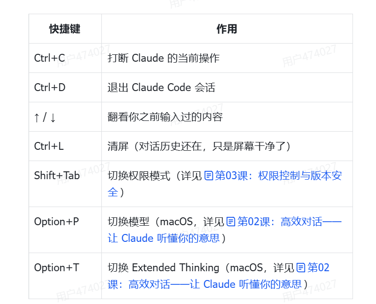

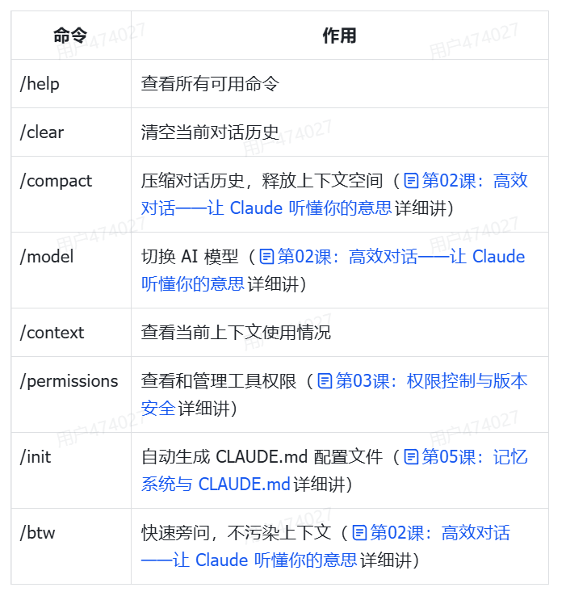

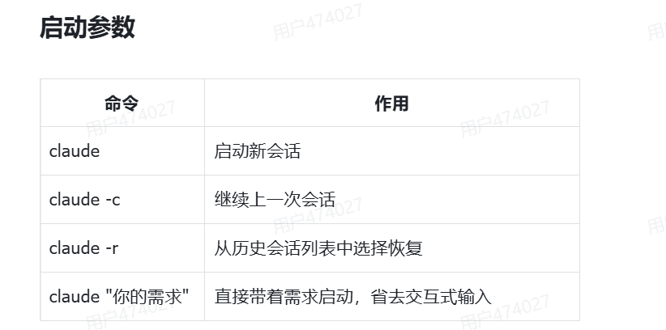


VS 插件内置独立二进制，**不会调用你 PATH 里的 `claude` CLI 程序**，两者是两套独立进程；

**同一个项目：CLI 和 VS 插件会话互通，历史记录双向可见**。但两者**共用同一套本地存储目录**：Windows `%USERPROFILE%\.claude\`，所有会话、全局配置、API 密钥、代理设置都存在这里。


具体、完整（上下文）描述目标  （不用规定步骤）---->迭代

@引用文件

/model      模型切换

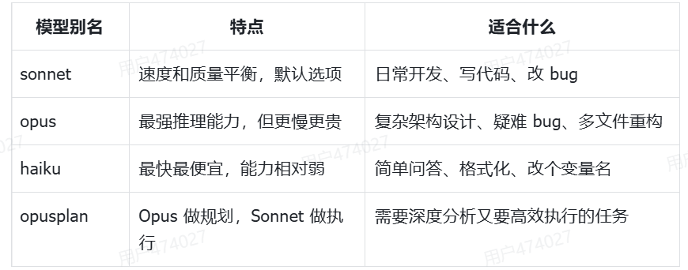

`extended thinking`:深入推理 alt+t切换开关 首次需要运行/terminal-setup来安装快捷键  ctrl+o详细过程  

多线程相关的bug(竞态条件、死锁)。复杂的类型推导或模板元编程问题。性能分析:为什么这段代码比预期慢。架构决策:A方案和B方案哪个更好。简单任务(比如 帮我写个for循环)Extended Thinking没什么意义。


shift+tab (/plan )  模式切换  

Plan模式：计划分析（不修改） 学习理解阶段，需求大修改多先看方案，复杂难多种解决路径不确定(你会怎么做？列出方案解决步骤)       先规划后执行

帮我看看这个项目的结构，给我一个简要概述:用了什么语言和框架、主要的源文件都是做什么的、入口在哪里。这个项目怎么编译和运行?哪些 TODO或者FIXME没有处理? main.cpp里的函数在做什么?


上下文窗口（session）

/context 查看使用情况

/compact   压缩  重点关键信息（细节丢失）    /compat 保留.....      对话时间长20分钟/出现遗忘/响应慢/新的子任务不需要之前的细节

**claude -new  开启新对话**


/clear  清空

右键粘贴


同一个项目目录下可以创建多条会话，每条对话有唯一`session-id`存储为单独`.jsonl`日志文件。

全局共享信息：

CLAUDE.md (claude.md)：  项目全局规则，所有会话启动都会自动读取。

自动记忆（Auto Memory）：项目级长期摘要，新会话会加载过往会话(提取架构、技术栈、约定规则等精简摘要)作为背景参考，不会完整读取另一条会话。

使用：

`claude`直接启动 / `/new`命令  全新空白会话（会话1系统菜单开发，会话2单独调试 CMake 编译）

`/branch` / `claude --fork-session`  分支会话（基于当前会话**复制完整历史**生成一条全新独立会话；

分叉后两条会话彻底隔离，后续操作互不影响；适合 “试错方案”：原会话保留稳定代码思路，分支会话尝试重构、换算法。）

所有会话文件路径：

```
~/.claude/projects/【项目目录哈希值】/session-【唯一UUID】.jsonl
```

| 文件        | 归属                       | 给谁看       | Claude 读取逻辑                                              |
| :---------- | :------------------------- | :----------- | :----------------------------------------------------------- |
| `README.md` | 通用项目文档（所有人标准） | 人类开发者   | Claude 只会**被动参考**，不会强制遵守；仅当作参考资料，不约束 AI 行为 |
| `CLAUDE.md` | Claude CLI 专属配置文件    | 仅 Claude AI | 强制全局规则，**本项目所有会话自动加载**，约束 AI 编码规范、项目架构、禁止操作、代码风格，多条会话共享同一套约束 |

约束AI   所有 Claude 会话统一编码风格、项目目录结构、禁止踩坑写法 等

教/提示人    写教程、给别人教怎么编译运行项目 → 写进 `README.md`

`/btw` 快速旁问

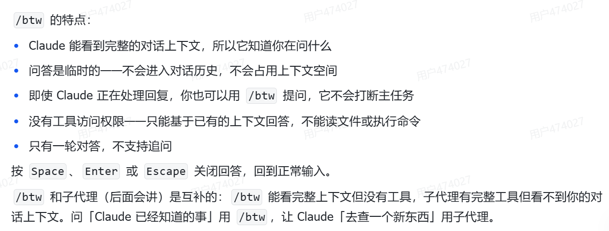

小技巧

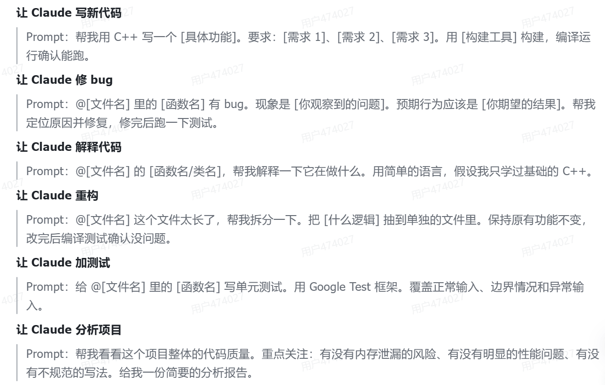

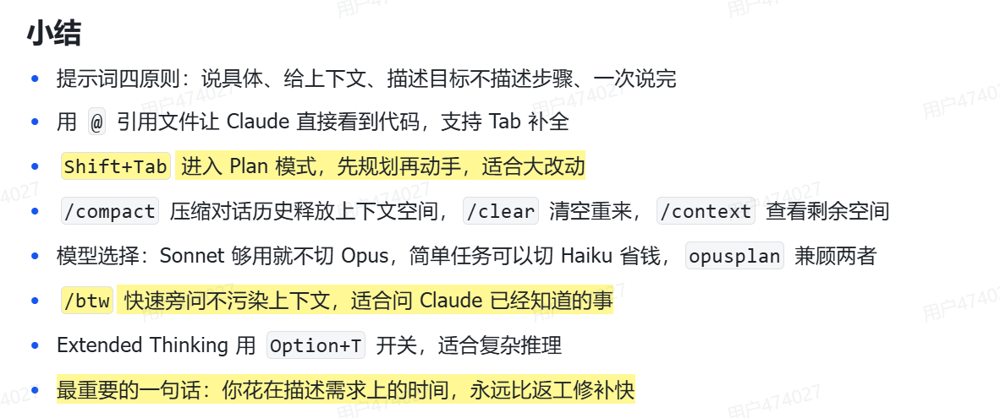

迭代优化---报错信息直接贴---给claude看现象不是猜测---会话长就新开---超3个(多)文件的修改先Plan


## 3.权限版本

### 权限

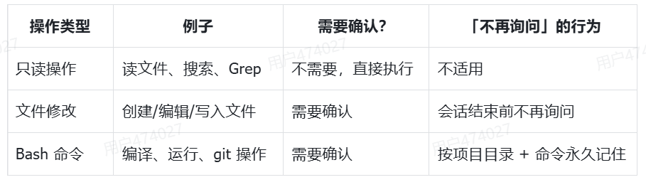

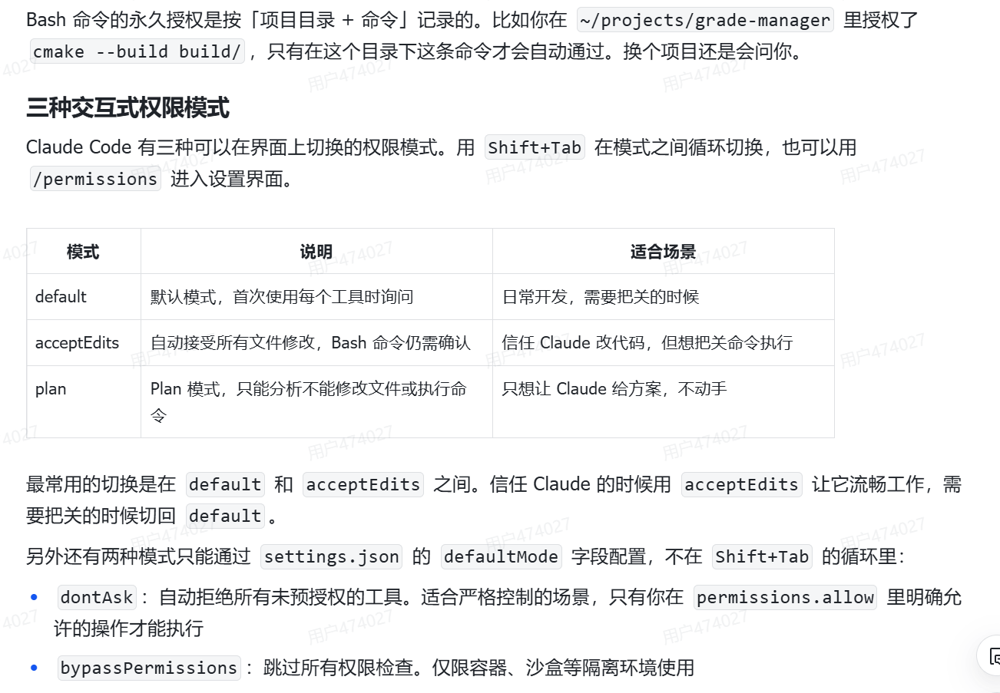

#### `/permission `    允许

''`allow/ask/deny`":  [Bash(命令 可包含*)/Read(路径)/Edit(路径)]

系统会按**deny（最高） > ask > allow（最低）**依次匹配，匹配到任意一条，立刻终止判断，后面列表不再检查。（默认 ask ）

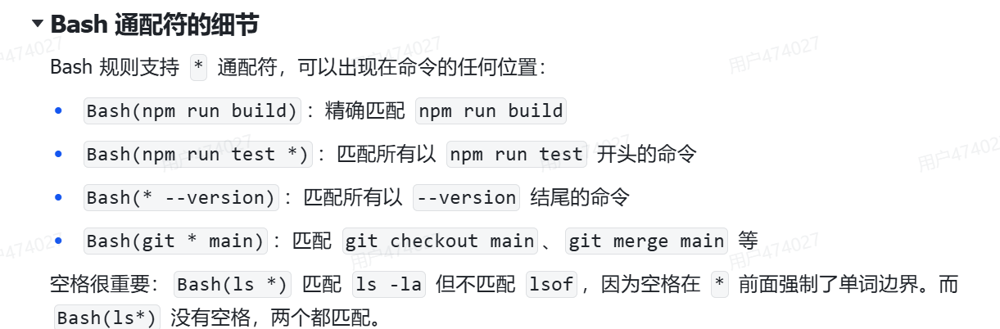

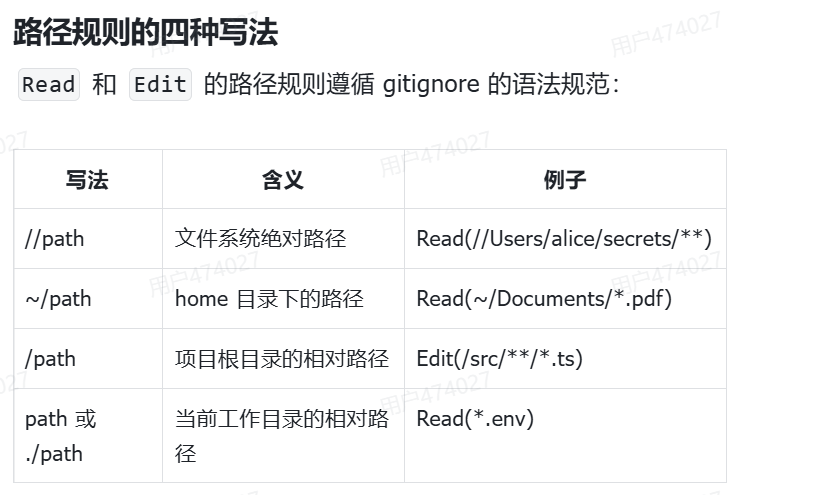

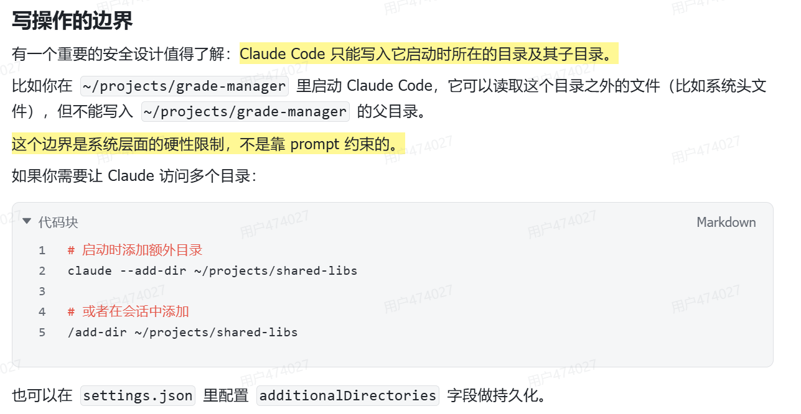

#### 例子：

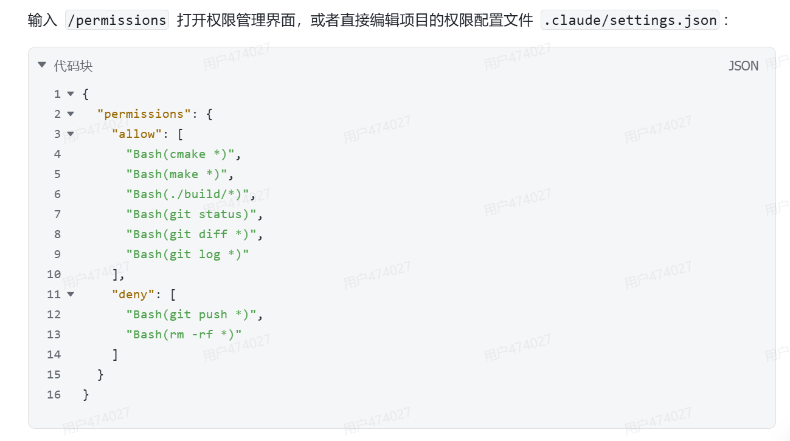

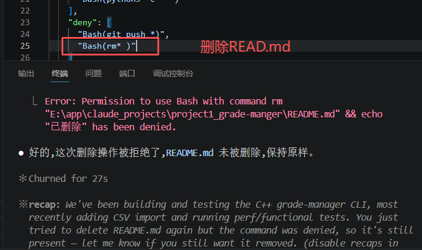

### 版本checkpoint

只跟踪Claude用文件编辑工具(write/Edit)修改的文件。Bash命令不追踪

`claude -c`或`claude--resume`继续对话后，仍然可以回退 。默认30天后自动清理(可配置)


回退: 按`Esc`两次(或输入`/rewind`)打开回退菜单。

会话历史消息列表，选择消息，选择操作

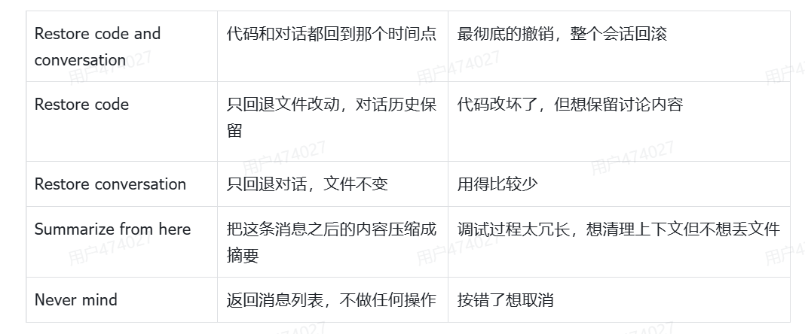

#### 例子：

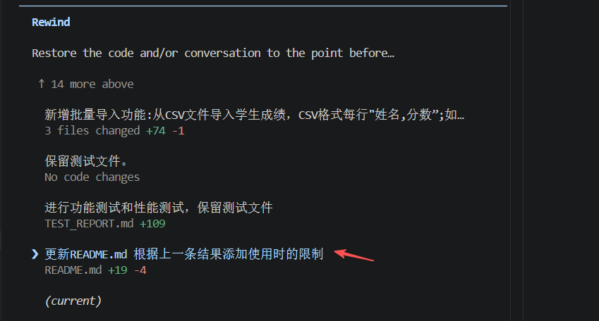

按下回车键选择 `Restore code and conversation` 回退到**这条指令执行之前** 的状态。**代码层面**撤销本次 `README.md` 的 `+19 -4` 修改，**README 恢复成旧版本**。

Claude Code 的Rewind(回退)没有原生 撤销回退 功能。A→ B → C → D（最新 current），回退到B那么B、 C、D 全部清空。


### git

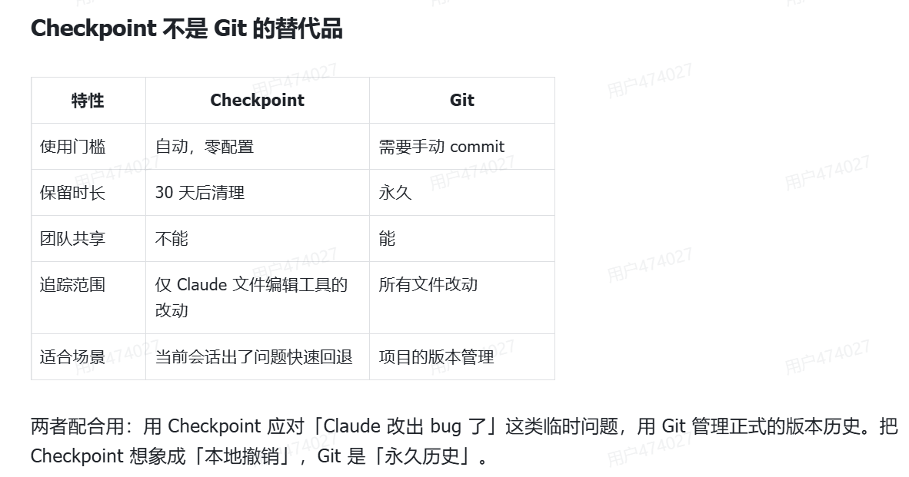


Claude Code 能参与Git工作流（Bash命令）`git diff` `git add``git commit`

一般情况会在权限配置里**禁止**`git push`

做比较大改动时，建议让Claude先创建一个新分支


`git checkout -b 分支名 ` 创建分支 + 切换到新分支

`checkout`：切换分支的基础指令

`-b`：参数含义 **create new branch**

`git branch `      查看本地所有分支,带`*`标记的是当前正在工作的分支。

废弃分支：切回主分支后删除

 `git checkout main ``git branch -D feature/import-csv`

分支开发成功：切回主分支后合并到主分支

`git checkout main ``git merge feature/import-csv`

补充事项：

项目根目录必须提前初始化 Git（执行过`git init`），否则该命令会执行失败；

分支创建前，把当前未保存修改提交：`git add . && git commit -m "保存当前稳定版本"`；

开启 A 自动全部允许编辑后，Claude 会自动修改头文件、源文件、CMake 配置。


**Git worktree** 

1. 普通分支（`git checkout -b`）

不能同时打开「原版代码」和「修改版分支代码」，想同时看两个版本，只能复制整个项目文件夹。

2.Git worktree在同一个 Git 仓库，**创建多个独立文件夹（工作区）**，每个文件夹绑定一个专属分支。

多分支**同时打开、同时编辑、同时编译运行**，互不干扰；共用一套 Git 仓库元数据（`.git`），不重复存储源码省空间；主目录完全干净，实验性改动全部隔离在新文件夹不会污染原项目。

`git worktree add ../grade-manager-experiment -b experiment/sqlite-storage`：创建新独立工作区（和原项目同级目录），自动新建专属分支并绑定到这个新文件夹。（执行后没切换，在旧的目录工作区)

删除废弃 worktree：

`git worktree remove ../grade-manager-experiment`

`git branch -d experiment/sqlite-storage`

`claude --worktree 路径`  打开已经提前建好的 worktree 工作区。

**同时打开 两个终端、进入两个不同的文件夹、分别编译**

独立对话 Session：互相隔离，新 worktree 默认看不到旧分区的会话

项目全局记忆(auto-memory、CLAUDE.md、项目全局配置):同一个Git仓库所有 worktree 全部共享

#### 例子：

```
git worktree add ../grade-manager-experiment -b experiment/sqlite-storage

cd ../grade-manager-experiment
# 进行相关改动操作
# 全部改动提交到实验分支
git add .
git commit -m "完成SQLite存储新功能开发"
# 切回原版主目录（main分支）
cd ../project1_grade-manger
# 把实验分支代码合并进main
git merge experiment/sqlite-storage
# 删除实验worktree关联+本地文件夹
git worktree remove ../grade-manager-experiment
# 功能稳定,合并完成后这个分支使命结束，手动删除本地分支：
git branch -d experiment/sqlite-storage
#后续还需要复用分支迭代,保留分支只删除worktree文件夹，下次要重新创建 worktree
git worktree add ../grade-manager-experiment experiment/sqlite-storage
```


### 小结

Claude大规模修改前，先发一条简单的消息，Checkpoint记录改动前状态。可以回退。

敏感操作用`deny `保护，至少要配这两条禁止`Bash(git push *)``Bash(rm -rf *)`

Checkpoint 不覆盖 Bash ，只覆盖Claude的文件编辑工具Write/Edit的操作

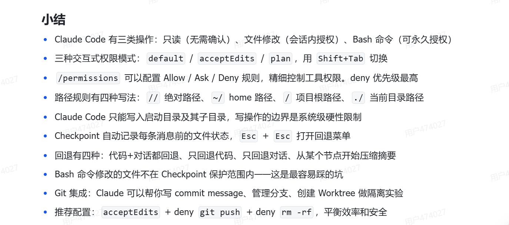


## 4.工具

### agentic loop

agentic loop  思考一执行一看结果一修复一再执行

三阶段划分:收集上下文----采取行动----验证结果

Claude Code是一个**agentic harness(智能体执行框架)**。本身不是AI模型，是套在模型外面的**一层执行环境**一一提供工具、管理上下文、处理权限、驱动循环。

模型负责**推理**，工具负责**行动**。

### 内置工具

完整工具列表  `/config`-->`Settings`

工具权限可在`/permissions`里设置

##### 文件操作

`Read`  

`Edit`   

`Write`  

 `NotbookEdit`  编辑Jupyter Notebook单元格,用Python做数据分析。

##### 搜索类

`Glob`   **文件名**模式搜索（text_开头/.cpp结尾）

`Grep`   **内容正则**搜索（找出所有包含TODO的行）

##### 执行类

`Bash ` shell命令（CLI命令行可执行的命令）

`EnterPlanMode/ExitPlanMode `  进入/退出  Plan 模式
`EnterWorktree/EnterWorktree`   创建和退出 Git Worktree  

##### Web类

`WebSreash`  搜索互联网（询问一些信息  可能会联网查找最新消息）

`WebFetch`   抓取URL内容（新消息 抓取下来）

##### 代码智能类

`LSP`  通过语言服务器获取代码智能信息一类型错误、编译警告、跳转到定义、查找引用、符号列表等。Claude每次编辑文件后会自动检查有没有引入新的类型错误。这个工具需要安装对应代码智能插件去能用。

##### 其他工具

`agent`  子代理，独立上下文窗口
`TaskCreate / TaskList / TaskUpdate / Taskstop / Taskoutput `    管理后台任务
`AskuserQuestion`   向你提问。遇到需要用户决定的情况(比如  函数要用方案A还是方案B?)，用这个工具向你提问。


### 扩展层

##### `CLAUDE.md `   

**Markdown文件**，**每次启动**会话都会**读取**（项目的技术栈、编码规范、构建命令、注意事项）

有一套分层的记忆体系。

企业策略级(Managed Policy)

项目级(./CLAUDE.md 或./.claude/CLAUDE.md）团队共享，提交到git

用户级(~/.claude/cLAuDE.md) 个人偏好，所有项目共享

规则目录(.claude/rules/*.md):按文件路径加载不同规范


##### `Skills`

**按需加载**的知识和流程。本质上是一个**Markdown文件**

会话开始时只看到Skill的名字和简短描述，只有被用到时才加载完整内容
**手动触发/自动触发**

Claude Code自带了一些内置 Skill，` /simplify`(简化代码)、`/batch`(批量操作)、`/debug`(调试辅助)，也可以自己创建，通过`/skills`命令看自己创建的

OpenClaw的Skill市场一ClawHub。一个社区驱动的Skill仓库，覆盖编码、DevOps、浏览器自动化、搜索调研、生产力工具等各种场景。可以用一条命令直接**安装别人写好的Skill**:
`clawhub install @author/skill-name`


##### `Sub-Agents`

Sub-Agents(子代理)是**隔离执行的工作单元**。

拥有**独立上下文窗口**，不能嵌套创建，可以在前台或后台运行，只**返回结果**给主Claude不保留中间过程（可以指定子代理 工具权限）

Claude Code内置子代理：

Explore:探索代码库结构。适合「帮我看看这个项目的目录结构和核心模块」这类任务。

Plan:制定方案。适合「分析一下怎么重构这个模块」这类需要深入思考的任务。

General-purpose:通用子代理。可以通过提示词让Claude 创建临时子代理。


##### `Hooks`

事件驱动的**自动化脚本**（纯确定性）

shell 脚本(也支持HTTP端点和 LLM prompt)，**特定事件发生自动执行。**

官方18种Hook事件，常用几种:

PreTooluse:使用某个工具之前触发。比如每次Edit 前先格式检查。

`PostTooluse`:使用某个工具之后触发。

`Notification`:发出通知时触发。比如收到通知后转发到飞书或钉钉。

`stop`:完成任务(停止循环)时触发。比如任务结束后自动生成一份报告。

`Sessionstart/SessionEnd`:会话开始和结束时触发。

`Subagentstart/subagentstop`:子代理启动和完成时触发。

`InstructionsLoaded`:用来排查指令加载问题。

**Hooks不走AI推理，不耗费token，执行结果确定。**


##### `MCP`

Model Context Protocol模型上下文协议，**连接外部服务**（**扩充工具**）

本质是一个协议标准，定义了Claude怎么和外部工具通信。配置一个MCP Server告诉Claude「有一个数据库，你可以用这些命令查询它」Claude就多了一个工具。

MCP Server可以配在项目级(对项目生效)或用户级(所有项目共用)

现象：MCP工具的定义(名称、描述、参数schema、示例)都要**占用模型上下文窗口**token，接多了token消耗大。不如使用传统的API和 CLI。


##### `Agent Teams`

组一个团队大家各干各的互相交流。每个Agent都是**独立的Claude Code会话**，之间可以**互相**发消息、共享任务列表、自主协调分工。

**任务复杂**到需要**多个视角同时**推进、且需要互相讨论的时候。

比如三个Agent 安全审查、性能分析、代码风格检查，互相交流 安全审查的Agent发现可疑点，性能分析的Agent说 确实有问题我这边看到了性能瓶颈

功能目前是实验性的，默认关闭，需要手动开启。


##### `Plugins`

一种**打包机制**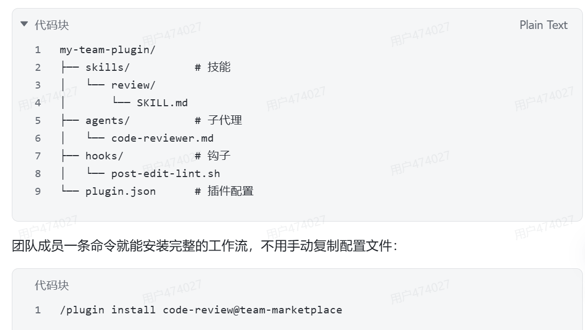

Plugin支持版本化和分发。

发布方式: 创建一个「Marketplace目录」，本质上是托管在GitHub 上的**Git 仓库**，里面有一个marketplace.json 文件，列出你所有的Plugin及其来源。在地验证没问题推上GitHub，团队成员用一条命令即可添加` /plugin marketplace add your-org/team-plugins`
就能浏览和安装你的Plugin。你更新Plugin后推送到GitHub，成员用`/plugin marketplace update `就能同步最新版本。


##### 总结

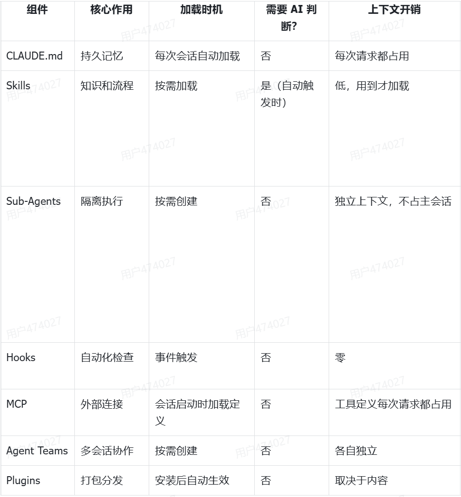

判断: **是否需要AI判断** 和 **加载频率**

需要AI判断+每次都用写进CLAUDE.md 。

需要AI判断+按需Skills或Sub-Agents。

不需要AI判断+固定触发Hooks。

需要连外部系统MCP。

需要多视角讨论Agent Teams。

需要打包分享Plugins。

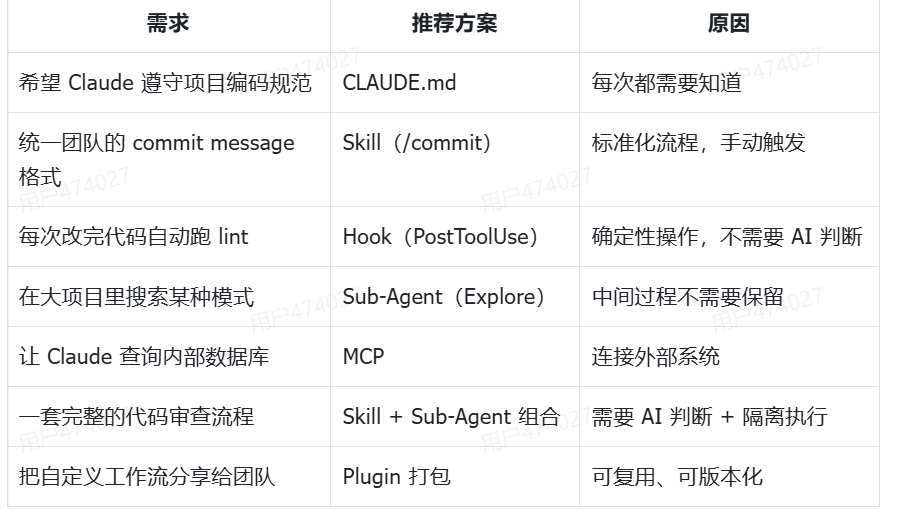

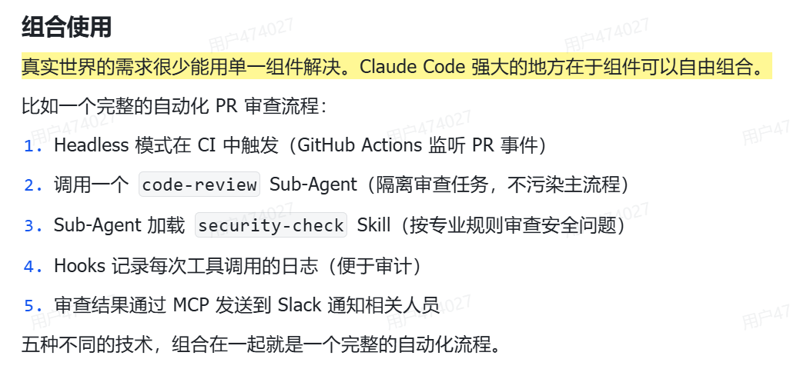


### 小结

Claude 说没有某个工具，可能版本太旧或者某些工具需要额外配置(比如LSP 需要安装代码智能插件)。用/doctor 诊断一下。

简单任务用了很多步骤，你觉得不必要在提示词「直接改就行，不用先分析整个项目」


## 5.记忆系统 


### CLAUDE.md

（给新人的入职手册）

##### 作用域 层级

**企业**  `C:\Program Files\claudecode\cLAUDE.md` 安装的地方

**项目**  项目根目录`./CLAUDE.md`或`./.claude/CLAUDE.md`  团队共享的项目知识应该提交到Git团队成员共用，是最常用的一层。

**个人**   `~\.claude\CLAUDE.md`  ~当用户家目录（用户根文件夹`C:\Users\.claude`\CLAUDE.md）

在项目的子**目录里启动**ClaudeCode，自动加载CLAUDE.md，**向上加载上所有**，**向下读到**子目录文件**时按需加载**。

##### 示例：


##### .claude/rules/

拆分多个`专项.md`文件（path[ 多个文件名]），**读到** 匹配文件 时**才加载**对应`专项.md`。没设path和主CLAUDE.md一样启动时加载


##### 符号链接


##### @引用

`@path ` 引用文件，**用到时才加载**（path：绝对路径/相对路径）

```
CLAUDE.md
[...团队规范...]

#1.项目中包含的
参考 @README.md了解项目概况
参考 @package.json了解可用的 npm命令
API 规范见 @docs/api-spec.md

#2.个人偏好中的
#CLAUDE.md提交到git上时，没有这一条（只在我电脑上有）
@~/.claude/my-project-notes.md
```

##### 编写规则

**Less** is More，官方建议每个CLAUDE.md 文件控制在**200行以内**。

**具体**优于泛泛。

why/what/how 为啥这样做/什么能做什么不能做/怎样步骤做。

结合  **@引用 和   .claude/rules/**(条件规则 用到path内才加载）


##### 排除不想要的


### Auto Memory

(新人工作一周后自己的经验总结）

Auto Memory完全**由Claude管理**（判断哪些信息值得记录，**自动**保存）

存储位置 : `~/.claude/projects/<project>/memory/多个.md`，\<project>由Git仓库推导来，**同一个Git** 下的所有worktree和子目录**共享一个**记忆目录。如果没Git仓库，则用项目根目录路径。

**`MEMORY.md`入口文件**，会话开始时**自动加载前200行**，后续的按需取加载

**子代理**也可以维护自己的Auto Memory。

界面有"Writing memory" 或"Recalled memory" 提示，说明 Claude
正在写入或读取自动记忆。

可以手动触发去记忆到Auto Memory。对话中说[ 记住某件事 ]

### /init

自动**生成CLAUDE.md**。分析代码库，扫描项目结构、识别技术栈、找到构建命令和测试命令，然后把这些信息整理成CLAUDE.md。

已**有**CLAUDE.md，给出**建议改进**。

### /memory

列出当前会话**加载的**所有记忆文件  

所有层级`CLAUDE.md `、`rules `文件(不一定会显示)、`Auto Memory`。

查看加载的文件，**直接打开编辑**，开/关Auto Memory

提示:如果需要排查哪些指令文件被加载、什么时候加载、为什么加载，可以用`InstructionsLoaded `Hook来记录日志。


### 总结

CLAUDE.md 放规则，Auto Memory 放经验

写Claude不可能自己猜到的信息（项目用什么框架、构建命令是什么、团队有什么特殊约定）

只要某条规则不是每次都需要，扔到.claude/rules/里加个 paths 条件。

新项目第一步就跑/init，能给你一个框架。

定期审查你的记忆文件（过时规则比没有更糟糕会误导 Claude）


## 6.调试

### 调试

编译、运行后  出现bug  然后才调试去  修bug（被动的）

Claude code调试 核心步骤：描述现象---Claude 定位---修复---验证

完整报错信息，no猜测

read grep bash复现错误  分析

edit 

重新编译、运行    给出验证方法（测试、截图、预期输出）好提示词会给出验证步骤

### 错误

##### 编译错误

最好处理报错信息明确、位置精准、修起来快。

给完整编译输出不要只截关键，模板展开、调用链上下文在上面几行。有多个编译错误先修第一个，后续错误可能是连锁反应。告诉Claude编译命令(cmake--build build)，让它修完后直接编译验证结果。

`Prompt`:

编译报错了，帮我修改。修完之后运行cmake --build build 确认编译通过。完整报错如下[粘贴编译输出]

##### 运行时崩溃

常见表现Segmentationfault,Abort、未捕获的异常等。

能稳定重现的操作、原始报错、如何编译运行。重现步骤尽量具体，把你做过的操作都列来。有核心转储(core dump)，可以把相关信息给Claude分析。对C/C++程序，Debug 构建， -g，Address Sanitizer (-fsanitize=address )能让崩溃原因更清晰。

`Prompt`:

编译没问题，运行到一半崩溃。

重现步骤: 运行 ./build/grade_manager，输入3个学生信息后选择「删除学生」输入一个不存在的学生ID，程序就崩了。

报错:Segmentationfault(coredumped).

编译命令: cmake -B build -DCMAKE_BUILD TYPE=Debug && cmake --build build.

修完之后用同样的步骤验证不再崩溃。

`Prompt`:

帮我在 cMakeLists.txt 里加上 Address Sanitizer (-fsanitize=address)重新编译后运行,根据ASan报告定位并修复问题。

##### 逻辑错误

最难调程序不崩溃、不报错，但结果不对。

说清 期望输出 和 实际输出。要说「我期望X，实际Y」给够业务上下文，让Claude加打印逐步缩小范围

`Prompt`:

grade_manager 平均分计算有问题。输入了90,85,78三个成绩，平均分应该是84.33，但程序显示0。不崩溃，也没有报错。帮我在计算平均分的相关函数里加调试输出，看中间变量的值，定位问题后修复，并用上面的输入去验证输出是否正确。

##### 复杂bug


Extended Thinking默认开启，Ctrl+o看思考过程，复杂bug建议开着盯着看（简单问题可alt+A关闭/ /cofig调整）

effort level(思考力度) 控制自适应推理深度，Iow、medium、high等（/model中切）ultrathink一次

切模型 opus、opusplan、sonnet

### 总结

完整报错（片段）、原始现象（猜测）、问题能重现步骤（bug不能稳定重现，可能未初始化、竞态、依赖外部状态等问题）、用@缩小范围、/btw旁问、用管道把日志给claude（在终端执行命令`cat build-error.txt|claude-p 帮我分析这个编译错误，给出修复建议"`或者在交互模式里把日志全文粘贴进去）、一个bug一个会话（卡了三四轮还没解决，总结（常试、排除）/c1ear开新会话写入总结。干净上下文+好提示词，比堆满失败的历史有效）


加调试日志、缩小排查范围、追踪调用链、大范围搜读一>子代理、知道文件一>@+主对话

`Prompt`:帮我在 processGrades 函数的每个关键步骤加上调试输出，打印输入参数、中间变量、返回值。运行一遍看输出，再根据输出定位问题，修复后删掉调试日志。

`Prompt`:这个bug只在「删除学生」功能触发，不影响「添加学生」。问题大概率在处理删除的代码路径里请先聚焦这块，不要大范围改无关模块。

`Prompt`:calculateAverage 返回了0，但我不确定是它算错了还是调用方传参不对。请从main开始追踪
到calculateAverage 的调用链，标出每一步的关键变量值是否合理。

`Prompt`:用子代理调查calculateAverage在项目里的所有调用方，看有没有可能传入空容器或未初始化数据的情况，把结论汇总给我。


修完bug一定要跑一边，提示词「修完后用某某命令编译/运行/跑 测试验证」。

有测试跑测试  提示词 跑测试(cmake --build build && cd build && ctest)，把失败测试修到全部通过。
Plan 模式 + opusplan/Opus 先分析再改。善用Checkpoint。


## 7.测试

### 测试

功能性能测试 提前发现问题，防bug（主动的）


## 8.阅读和重构


## git

### 简介

集中式/分布式区别：**本地是否有**完整的**版本库**历史！

集中式版本控制系统 ：版本库存放在中央服务器。从中央取最新版本、干活、推送给中央

分布式版本控制系统：每台计算机都有完整版本库。本地是Commit，多人协作push。

分布式核心设计是**同步**，而不是主从

Git版本控制系统优秀，因为**Git跟踪并管理   *修改*    而非文件**

修改（对文件的操作创建、删除、修改，对文件内容的操作增、删、改、）

工作区   目录比如`learngit`文件夹

版本库   隐藏目录`.git`（里面有  stage/index暂存区，自动创建第一个分支master，指针HEAD）

工作区--add--暂存区--commit--本地仓库的master

### 操作

```plain
//把当前目录变成Git可以管理的仓库，当前目录下多了隐藏`.git`文件，跟踪管理版本库(`ls -ah`)
git init

//创建文件编辑(工作区)
readme.txt  ...写了一些东西

//把文件添加到缓存(暂存区)
git add readme.txt

//把文件提交到仓库(本地仓库)  -m 提交说明注释 
//暂存区里所有文件打包，生成永久版本快照存入本地Git仓库，唯一commit哈希记录可回滚、切换版本。
git commit -m "wrote a readme file"

//查看当前仓库文件改动状态  扫描项目所有文件
//区分 修改未暂存/暂存待提交/新增文件/未跟踪文件，只看文件名不看细节。
git status 

//查看文件具体代码改动  对比当前文件和 上次暂存/提交版本
//根据diff内容生成 commit message（提交说明）
git diff

//查看提交记录(只能看到没被丢弃的commit)，可用来 版本回退 
 git log -1 
大概输出：
commit 1094adb7b9b3807259d8cb349e7df1d4d6477073 (HEAD -> master)//唯一ID  
Author: Michael Liao <askxuefeng@gmail.com>//谁
Date:   Fri May 18 21:06:15 2018 +0800//什么时间
append GPL//提交了什么 提交说明
//HEAD最新  HEAD~10往前10版  -1 看一条记录
//--oneline 简洁模式，短ID+提交说明(c729010 feat: 增加成绩导出功能)  

//查看本地所有操作记录（包括reset删除、切换分支、丢弃的commit），可用来 重返未来
git reflog


//查看当前仓库文件改动状态  扫描项目所有文件
//区分 修改未暂存/暂存待提交/新增文件/未跟踪文件，只看文件名不看细节。
git status 
输出：
On branch master//主分支
Changes not staged for commit://修改未缓存
  (use "git add/rm <file>..." to update what will be committed)//1
  (use "git checkout --<file>..."to discard changes in working directory)//2
	modified:   readme.txt//1.add去缓存 2.撤销修改
    deleted:    test.txt// 1.rm要删除,然后git commit就真正删除 2.撤销删除，恢复文件
Changes to be committed://换存未提交
  (use "git reset HEAD <file>..." to unstage)//撤销暂存区的提交，放回工作区
	modified:   readme.txt
最后---已提交走版本回退...
//1.版本回退，用 git log查看提交历史，确定回退版本号
git reset [模式] 版本ID
//soft-暂存区，mixed（默认）-工作区，hard-本地文件也回到旧版本找不回（除非用 reflog）
//2.重返未来 ，用 git reflog查看命令历史，确定到未来版本号
git reset --hard c729010//用commit ID
git reset --hard HEAD@{1}//用HEAD索引

```

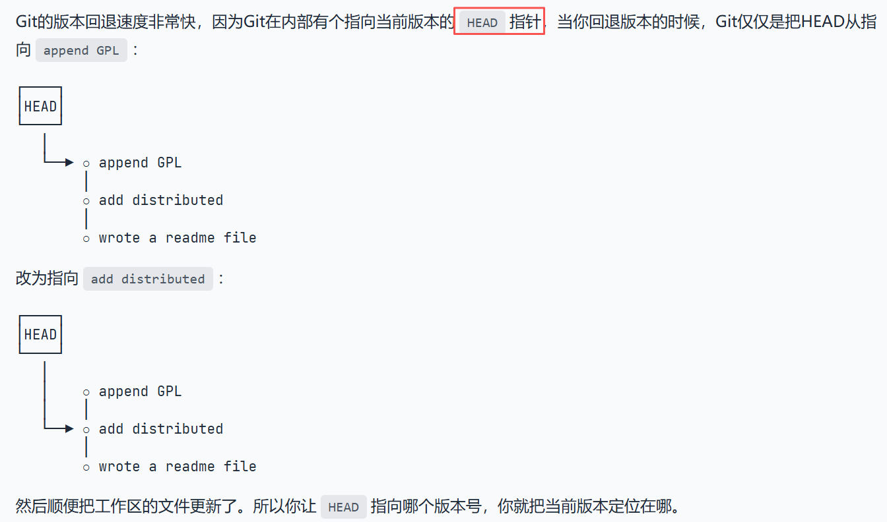

### 远程

#### ssh

Git支持SSH协议，GitHub知道了你的公钥，就可以确认只有你自己才能推送。

第1步：SSH Key。用户主目录下找.ssh目录。

有 再看看目录下有没有`id_rsa`和`id_rsa.pub`这两个文件；

没有 打开Shell（Windows下打开Git Bash）创建`ssh-keygen -t rsa -C "邮箱"`。

`id_rsa`是私钥不能泄露，`id_rsa.pub`是公钥可以告诉任何人。

第2步：登陆GitHub，打开“Account settings”，“SSH Keys”页面，点“Add SSH Key”，填上任意Title，在Key文本框里粘贴`id_rsa.pub`文件内容。

#### 仓库

1.已有本地仓库，关联到GitHub远程仓库并推送内容。

GitHub创建新空仓库(远程仓库名 learngit )。

关联远程库，在本地仓库下执行命令`git remote add origin git@github.com:用户名/learngit.git`，关联远程库时必须给远程库指定一个名字`origin`默认名；

首次推送`git push -u origin master`带 -u ，本地 master推远程，并把本地和远程master关联。

日常推送 `git push origin master` 


查看远程库信息：`git remote -v`

解除本地和远程的绑定关系：`git remote rm origin `只是 解除绑定 ，不是物理删远程库。

2.从零开发时，先创建远程库，再克隆到本地。

GitHub创建新仓库。克隆到本地`git clone git@github.com:用户名/gitskills.git`

还可以用`https://github.com/michaelliao/gitskills.git`这样的地址，速度慢麻烦。

### 分支管理


PR？


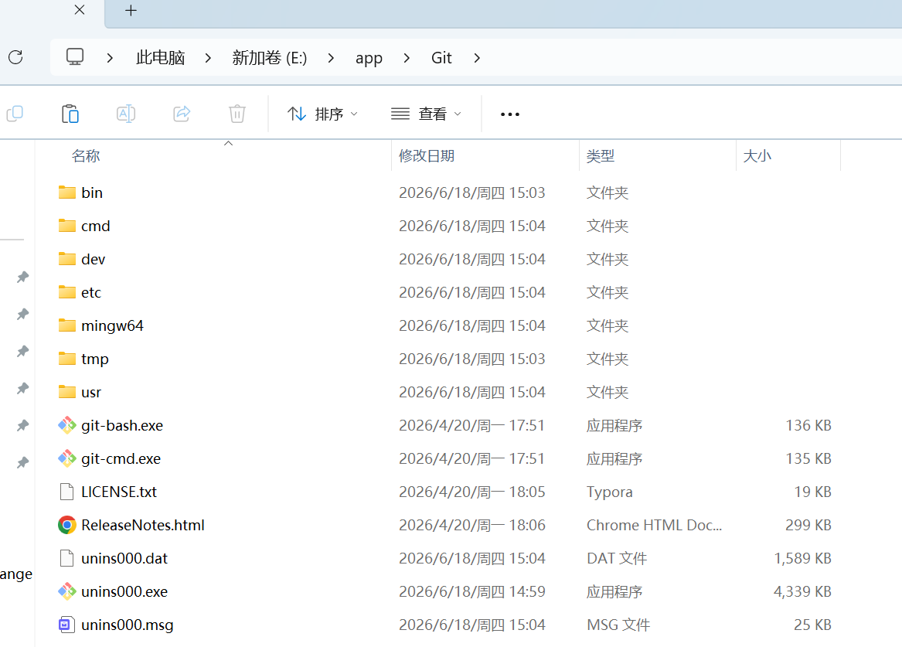

`git-bash.exe `Windows 封装的**类 Linux 终端 ** Linux 指令， git 命令 。

`git-cmd.exe`基于系统自带 cmd.exe 的终端，仅保留 git 命令。

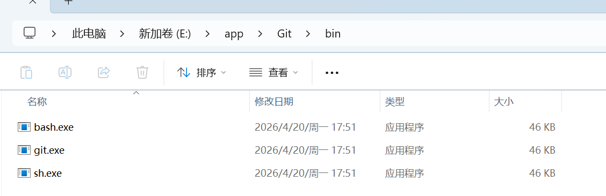

`git.exe` Git 核心主程序， git 操作底层执行文件。终端 输入`git xxx`，调用这个文件。

`sh.exe` 轻量化 shell 解释器，执行`.sh` 脚本，由 bash 自动调用。


## 9.git

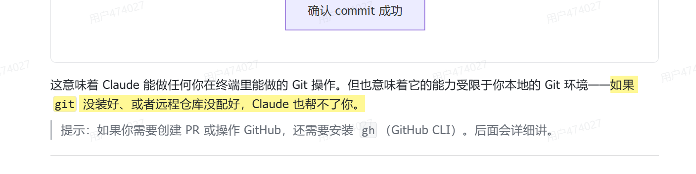


当前9

练习6

笔记7


