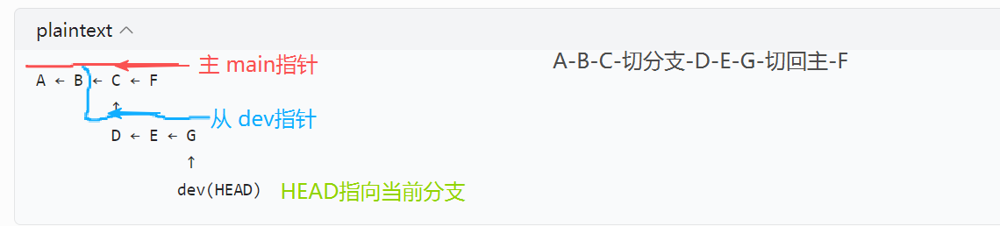
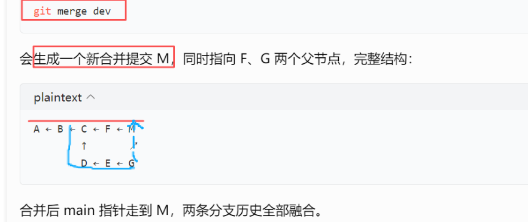

## 资料

[Git是什么 - Git教程 - 廖雪峰的官方网站](https://liaoxuefeng.com/books/git/what-is-git/index.html)

## git

### 简介

集中式/分布式区别：**本地是否有**完整的**版本库**历史！

集中式版本控制系统 ：版本库存放在中央服务器。从中央取最新版本、干活、推送给中央

分布式版本控制系统：每台计算机都有完整版本库。本地是Commit，多人协作push。

分布式核心设计是**同步**，而不是主从

Git版本控制系统优秀，因为**Git跟踪并管理   *修改*    而非文件**

修改（对文件的操作创建、删除、修改，对文件内容的操作增、删、改、）

工作区   目录比如`learngit`文件夹

版本库   隐藏目录`.git`（里面有  stage/index暂存区，自动创建第一个分支master，指针HEAD）

工作区--add--暂存区--commit--本地仓库的master

### 基本操作

```plain
//把当前目录变成Git可以管理的仓库，当前目录下多了隐藏`.git`文件，跟踪管理版本库(`ls -ah`)
git init

//创建文件编辑(工作区)
readme.txt  ...写了一些东西

//把文件添加到缓存(暂存区)
git add readme.txt

//把文件提交到仓库(本地仓库)  -m 提交说明注释 
//暂存区里所有文件打包，生成永久版本快照存入本地Git仓库，唯一commit哈希记录可回滚、切换版本。
git commit -m "wrote a readme file"

//查看当前仓库文件改动状态  扫描项目所有文件
//区分 修改未暂存/暂存待提交/新增文件/未跟踪文件，只看文件名不看细节。
git status 

//查看文件具体代码改动  对比当前文件和 上次暂存/提交版本
//根据diff内容生成 commit message（提交说明）
git diff

//查看提交记录(只能看到没被丢弃的commit)，可用来 版本回退 
 git log -1 
大概输出：
commit 1094adb7b9b3807259d8cb349e7df1d4d6477073 (HEAD -> master)//唯一ID  
Author: Michael Liao <askxuefeng@gmail.com>//谁
Date:   Fri May 18 21:06:15 2018 +0800//什么时间
append GPL//提交了什么 提交说明
//HEAD最新  HEAD~10往前10版  -1 看一条记录
//--oneline 简洁模式，短ID+提交说明(c729010 feat: 增加成绩导出功能)  

//查看本地所有操作记录（包括reset删除、切换分支、丢弃的commit），可用来 重返未来
git reflog
输出：
0c725aa (HEAD -> main) HEAD@{0}: commit: 新增笔记首页html
d91ef2c HEAD@{1}: reset: moving to HEAD~1
58f3021 HEAD@{2}: commit: 写测试页面
21b4680 HEAD@{3}: checkout: moving from dev to main
70ac93b HEAD@{4}: commit: 分支dev：添加工具脚本

//查看当前仓库文件改动状态  扫描项目所有文件
//区分 修改未暂存/暂存待提交/新增文件/未跟踪文件，只看文件名不看细节。
git status 
输出：
On branch master//主分支
Changes not staged for commit://修改未缓存
  (use "git add/rm <file>..." to update what will be committed)//1
  (use "git checkout --<file>..."to discard changes in working directory)//2
	modified:   readme.txt//1.add去缓存 2.撤销修改
    deleted:    test.txt// 1.rm要删除,然后git commit就真正删除 2.撤销删除，恢复文件
Changes to be committed://换存未提交
  (use "git reset HEAD <file>..." to unstage)//撤销暂存区的提交，放回工作区
	modified:   readme.txt
最后---已提交走版本回退...
//1.版本回退，用 git log查看提交历史，确定回退版本号
git reset [模式] 版本ID
//soft-暂存区，mixed（默认）-工作区，hard-本地文件也回到旧版本找不回（除非用 reflog）
//2.重返未来 ，用 git reflog查看命令历史，确定到未来版本号
git reset --hard c729010//用commit ID
git reset --hard HEAD@{1}//用HEAD索引

```


### 远程

#### ssh

Git支持SSH协议，GitHub知道了你的公钥，就可以确认只有你自己才能推送。

第1步：SSH Key。用户主目录下找.ssh目录。

有 再看看目录下有没有`id_rsa`和`id_rsa.pub`这两个文件；

没有 打开Shell（Windows下打开Git Bash）创建`ssh-keygen -t rsa -C "邮箱"`。

`id_rsa`是私钥不能泄露，`id_rsa.pub`是公钥可以告诉任何人。

第2步：登陆GitHub，打开“Account settings”，“SSH Keys”页面，点“Add SSH Key”，填上任意Title，在Key文本框里粘贴`id_rsa.pub`文件内容。

#### 建仓库

1.已有本地仓库，关联到GitHub远程仓库并推送内容。

GitHub创建新空仓库(远程仓库名 learngit )。

关联远程库，在本地仓库下执行命令`git remote add origin git@github.com:用户名/learngit.git`，关联远程库时必须给远程库指定一个名字`origin`默认名；

首次推送`git push -u origin master`带 -u ，本地 master推远程，并把本地和远程master关联。

日常推送 `git push origin master` 


查看远程库信息：`git remote -v`

解除本地和远程的绑定关系：`git remote rm origin `只是 解除绑定 ，不是物理删远程库。

2.从零开发时，先创建远程库，再克隆到本地。

GitHub创建新仓库。克隆到本地`git clone git@github.com:用户名/gitskills.git`

还可以用`https://github.com/michaelliao/gitskills.git`这样的地址，速度慢麻烦。

### 分支管理

#### 指令

查看分支：`git branch`

创建分支：`git branch <name>`   多分支指针

切换分支：`git checkout <name>`或者`git switch <name>`   HEAD指针移动

创建+切换分支：`git checkout -b <name>`或者`git switch -c <name>`

合并某分支到当前分支：`git merge <name>`      无分叉/三方分叉

删除分支：`git branch -d <name>`   (已合并) 删除分支指针文件，节点依然保留

#### 原理





#### 冲突

`feature1`分支 修改（例子 最后一行）

`master`分支  修改（也改最后一行）

在  `master`分支下执行`git merge feature1` 出现 冲突，必须手动解决冲突后再提交。

```
git status

You have unmerged paths.//合并失败
  (fix conflicts and run "git commit")
  (use "git merge --abort" to abort the merge)
Unmerged paths:
  (use "git add <file>..." to mark resolution)
	both modified:   readme.txt//文件
	
直接看readme.txt的内容
Git is a distributed version control system.
Git is free software distributed under the GPL.
Git has a mutable index called stage.
Git tracks changes of files.
<<<<<<< HEAD     //Git用<<<<<<<，=======，>>>>>>>标记出不同分支的内容
Creating a new branch is quick & simple.
=======
Creating a new branch is quick AND simple.
>>>>>>> feature1

手动解决冲突后再提交
用带参数的git log看分支合并情况
git log --graph --pretty=oneline --abbrev-commit
*   cf810e4 (HEAD -> master) conflict fixed
|\  
| * 14096d0 (feature1) AND simple
* | 5dc6824 & simple
|/  
* b17d20e branch test
* d46f35e (origin/master) remove test.txt

```

[解决冲突 - Git教程 - 廖雪峰的官方网站](https://liaoxuefeng.com/books/git/branch/merge/index.html)  学到这里了


### 软件安装后


`git-bash.exe `Windows 封装的**类 Linux 终端 ** Linux 指令， git 命令 。

`git-cmd.exe`基于系统自带 cmd.exe 的终端，仅保留 git 命令。


`git.exe` Git 核心主程序， git 操作底层执行文件。终端 输入`git xxx`，调用这个文件。

`sh.exe` 轻量化 shell 解释器，执行`.sh` 脚本，由 bash 自动调用。


