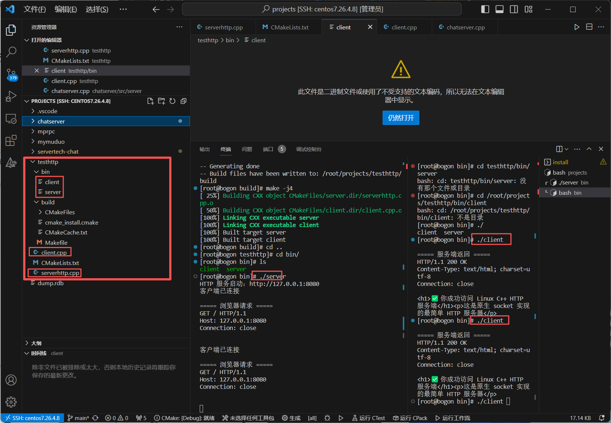
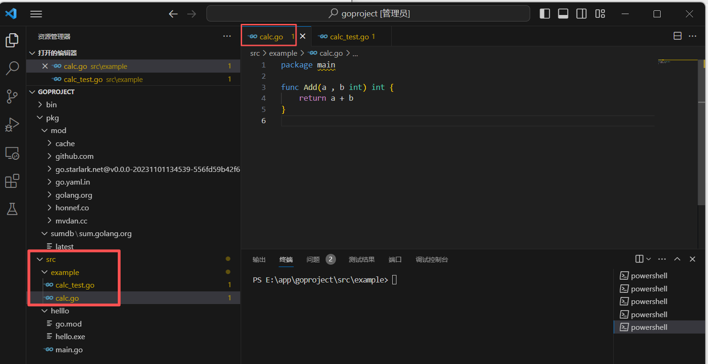
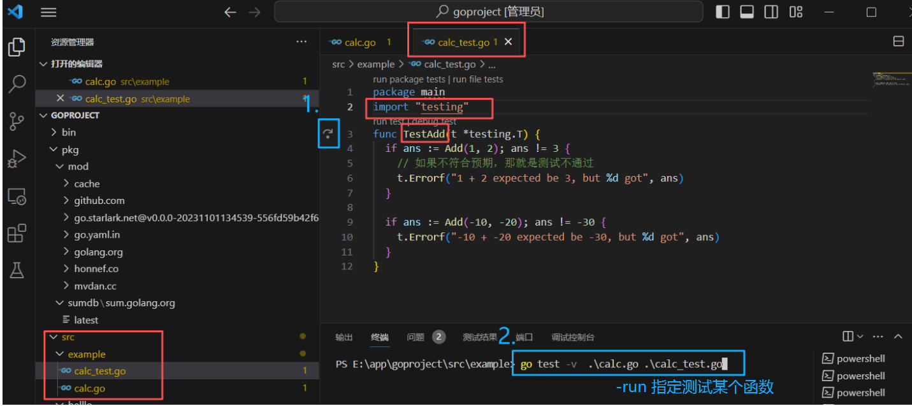

### C++补充

#### HTTP

##### 服务端

```
#include <iostream>
#include <stdio.h>
#include <stdlib.h>
#include <string.h>
#include <unistd.h>
#include <sys/socket.h>
#include <netinet/in.h>

using namespace std;

int main() {
    // 1. 创建 socket 文件描述符
    int server_fd = socket(AF_INET, SOCK_STREAM, 0);
    if (server_fd < 0) {
        perror("socket failed");
        return 1;
    }

    // 2. 绑定地址和端口
    struct sockaddr_in addr;
    addr.sin_family = AF_INET;
    addr.sin_port = htons(8080);         // 端口 8080
    addr.sin_addr.s_addr = INADDR_ANY;   // 监听所有网卡

    if (bind(server_fd, (struct sockaddr*)&addr, sizeof(addr)) < 0) {
        perror("bind failed");
        return 1;
    }

    // 3. 开始监听
    if (listen(server_fd, 5) < 0) {
        perror("listen failed");
        return 1;
    }
    cout << "HTTP 服务启动：http://127.0.0.1:8080" << endl;

    while (1) {
        // 4. 等待客户端连接（浏览器访问时触发）
        int client_fd = accept(server_fd, NULL, NULL);
        if (client_fd < 0) {
            perror("accept failed");
            continue;
        }
        cout << "客户端已连接" << endl;

        // 5. 读取浏览器发来的 HTTP 请求
        char buffer[1024] = {0};
        recv(client_fd, buffer, sizeof(buffer), 0);
        cout << "\n===== 浏览器请求 =====\n" << buffer << endl;

        // ===================== HTTP 响应 =====================
        const char* response =
            "HTTP/1.1 200 OK\r\n"
            "Content-Type: text/html; charset=utf-8\r\n"
            "Connection: close\r\n"
            "\r\n"
            "<h1>✅ 你成功访问 Linux C++ HTTP 服务端</h1>"
            "<p>这是原生 socket 实现的最简单 HTTP 服务器</p>";

        send(client_fd, response, strlen(response), 0);
        // ======================================================

        // 关闭连接
        close(client_fd);
    }

    close(server_fd);
    return 0;
}
```

##### 客户端

```
#include <iostream>
#include <string.h>
#include <unistd.h>
#include <sys/socket.h>
#include <netinet/in.h>

using namespace std;
int main() {
    // 1. 创建 socket
    int sock = socket(AF_INET, SOCK_STREAM, 0)
    // 2. 连接服务端
    struct sockaddr_in addr;
    addr.sin_family = AF_INET;
    addr.sin_port = htons(8080);
    addr.sin_addr.s_addr = inet_addr("127.0.0.1");
    connect(sock, (struct sockaddr*)&addr, sizeof(addr));
    // 3. 发送 HTTP 请求
    const char* request =
        "GET / HTTP/1.1\r\n"
        "Host: 127.0.0.1:8080\r\n"
        "Connection: close\r\n\r\n";
    send(sock, request, strlen(request), 0);
    // 4. 接收服务端返回的数据
    char buffer[1024] = {0};
    recv(sock, buffer, sizeof(buffer), 0);
    cout << "\n===== 服务端返回 =====\n" << buffer << endl;
    close(sock);
    return 0;
}
```



#### RPC

##### 服务端

##### 客户端

#### Websocket

##### 服务端

##### 客户端

### 简单语法

#### 变量定义

全局变量与局部变量

1. 定义在函数体（包括main函数）内的变量都是**局部**变量，**定义了就必须使用**
2. 定义在外部的变量就是**全局变量**，**可以**只定义**不使用**

**首字母大写**的变量、函数。方法，属性可在**包外进行访问**

#### 输入输出

fmt.Printf("%v %T\n", "枫枫", "枫枫") // %v **任意类型**        %T**打印类型** string

fmt.Printf("%#v\n", "")      //**有显示** 用go的语法格式输出，很适合打印空字符串

fmt.Printf("%v\n", "")       //**空行**

fmt.Printf("%p\n", &a)       //**地址**

#### 数据类型

##### 基本数据类型

go语言的基本数据类型有 ：整数形  浮点型  字符串 布尔    复数

1.var n1 uint8 = 2 //**无符号整型8位** 一字节 uint8别名byte

默认的数字定义类型是int类型，大小取决于平台，**后面的数字**就是**2进制的位数**

3.**字符**型（都是一个字符  用单引号' '）  byte（**单字节**字符）和rune（**多字节**字符）

  var c1 = 'a'     var r1 rune = '中'

**字符串**类   用双引号

**多行字符串** 用反引号 

  var s = `今天

 天气  

 真好 `    里面的转义字符会原样输出

4.布尔类型默认值false，不允许将整型强制转换为布尔型，无法参与数值运算 与其他类型进行转换

##### 数组、切片、map

###### 1.数组

 var **array [3]**  int = **[3]int{1, 2, 3}**  

 var array1 = [3]int{1, 2, 3}

 var array2 = [...]int{1, 2, 3}  

###### 2.**切片**(可**类比**c++中**动态数组vector**)

为什么叫切片？可由数组切出来

```
var list[]string=[]string{}//定义切片  没写大小的数组
var list =[]string{}
list:=[]string{}
list:= make([]int, 2, 2)


list = append(list, "枫枫")
list[0] = "不知道"
fmt.Println(len(list)) // 切片长度
fmt.Println(list == nil) // true  定义时没初始化 默认为空

list1 := make([]int, 2, 2)//make函数创建 指定长度、容量的切片
fmt.Println(list1, len(list1), cap(list1))

//数组list[:]切出来的东西是切片  不是定长数组
var list = [...]string{"a", "b", "c"}
slices := list[:] // 用数组切出来的切片初始化   list[:] 从头到尾 list[1:2] 从1到2不包括2
fmt.Println(slices)    //[a b c] 输出整体切片中的每个元素
fmt.Println(list[1:2]) // list[1:2] 从1到2不包括2  是b

//切片排序
var list = []int{4, 5, 3, 2, 7}
sort.Ints(list)
fmt.Println("升序:", list)
sort.Sort(sort.Reverse(sort.IntSlice(list)))
fmt.Println("降序:", list)
```

- slices := list[:]   ？咋匹配上的

因为 Go 语言语法规定死了：

[5] /[...] int这种才叫数组（编译时就定死长度）

[] int`这种叫切片（动态长度）`数组[起始:结束]` 语法的返回值类型就是 `[]类型` → 切片

- sort.Sort(sort.Reverse(sort.IntSlice(list))) 降序

`sort.IntSlice(list)` → 把 list 转成排序接口类型

`sort.Reverse()` → 反转顺序（变成降序）

`sort.Sort()` → 执行排序

- fmt.Println(slices) **输出**数组/切片**整体**

###### 3.map

`无序`的k-v对的集合，map的key必须是基本数据类型，value可以是任意类型

map使用之前**一定要初始化**      fmt.Println(m1)  **打印整个表**

```
// 定义 并 初始化
var m1 = map[string]string{}
m2: = make(map[string]string)

m1["name"] = "枫枫"
fmt.Println(m1)  //打印整个表
fmt.Println(m1["name"]) //打印k对应的值v
delete(m1, "name")
fmt.Println(m1)

//1.一个变量接 → 只拿值   不存在就返回 0（零值）
//2.两个变量接 → 拿值 + 是否存在的真假（true/false）
var m1 = map[string]int{"age": 21, }
  age1 := m1["age1"] //1 
  fmt.Println(age1)  // 输出0
  age2, ok := m1["age1"]//2
  fmt.Println(age2, ok)//输出 0 false
```

#### 语句

##### if判断

if age <= 0 {    fmt.Println("未出生")      }

##### switch判断

go的switch的**多选一**，**满足其中一个**结果之后，就**结束switch**了

如果 输入12，希望能输出满足的所有条件，例如希望输出 未成年，青年    加**fallthrough**

//用法1

switch {  

case age <= 0:      fmt.Println("未出生")  //加  fallthrough

case age <= 18:    fmt.Println("未成年")  //加  fallthrough

case age <= 35:    fmt.Println("青年")  

default:    fmt.Println("中年") 

 }

 //用法2 和C++一样的用法

switch age {  

case 1:    fmt.Println("未出生")      

##### for循环及变体

1. 传统for循环       for 初始化;条件;操作   {     }

2. 死循环                for     {    }

3. while模式           for  i<= 100    {    sum += i    i++  }

4. do-while模式     for {    sum += i    i++    if i == 101 {      break    }  }

5. 遍历切片，map   rang(范围)

   `range` 就是 Go 专门用了**自动遍历工具**，它会自动帮你循环一遍**数组 / 切片 /map/ 通道**，**每次循环**给你**返回**当前位置的 **2 个东西**
   
   `_` 在 Go 里 = **空白标识符 / 占位符**作用：不接收，直接丢掉！

```
s := []string{"枫枫", "知道"}
for index, s2 := range s { // index, s（索引，对应位置的值）   range s遍历切片 s
    fmt.Println(index, s2)
}
输出
0 枫枫
1 知道


s := map[string]int{ 
    "age":   24,
    "price": 1000,
}
for key, val := range s { 
    fmt.Println(key, val)
}
输出：
age 24
price 1000
```

#### 函数

**func关键字**定义函数

关键字 函数名（参数）(返回值){  }

```
func add1(n1, n2 int) // 参数类型一样，可以合并在一起
func add2(numList ...int) // 多个参数

func fun1() {// 无返回值
  return // 也可以不写
}

func fun2() int {// 单返回值
  return 1
}

func fun3() (int, error) {// 多返回值
  return 0, errors.New("错误")
}

func fun4() (res string) { // 命名返回值
  return "abc"// 相当于先定义再赋值
}
```

##### 匿名函数  

函数可以嵌套调用，不能嵌套定义 用**匿名函数**去在**函数内定义函数**（像C++中 函数对象类型 function lambda表达式）

**func** main() {  

var add = **func**(a, b int) int {    //变量add 类型是函数类型 赋值  了一个函数

return a + b  }  

fmt.Println(add(1, 2))//传入两个参数 返回值一个int 打印返回值 

}

##### 高阶函数

```
func login() {
  fmt.Println("登录")
}
func userCenter() {
  fmt.Println("个人中心")
}
func logout() {
  fmt.Println("注销")
}

func main() {
  fmt.Println("请输入要执行的操作：")
  fmt.Println(`1：登录
2：个人中心
3：注销`)
  var num int
  fmt.Scan(&num)
  var funcMap = map[int]func(){ //map表注册 数字----对应执行的回调函数
    1: login,
    2: userCenter,
    3: logout,
  }
  funcMap[num]()//根据用户传入数组调用对应函数
}
```

##### 闭包

**内部函数** 关闭包裹 了**外部**函数的变量，即使**外部**函数**执行完了**，内部函数**依然持有 t** 这个变量这就叫闭包（Closure） ，函数在定义的函数体内可以访问外部定义的变量

例题：

设计一个函数，先传一个参数表示延时，后面再次传参数就是将参数求和

fun(2)(1,2,3) // 延时2秒求1+2+3

类比C++中      【 int【函数对象  fun(int)  】(int...) 】   函数**返回值为函数对象继续调用执行**函数**lambd**a表达式里传引用**捕获外部变量**

```
func awaitAdd(t int) func(...int) int {
  //time.Sleep(time.Duration(t) * time.Second)//在第一个函数中延时
  return func(numList ...int) (sum int) {
  //time.Sleep(time.Duration(t) * time.Second)//在第二个函数中延时  闭包
    for _, i2 := range numList {//`_` 在 Go 空白标识符/占位符 作用：不接收，直接丢掉！
      sum += i2
    }
    return sum
  }
}

func main() {
  fmt.Println(awaitAdd(2)(1, 2, 3))
}
```

##### inint

1. 用在**main**函数**执行之前**，被**自动按序调用**（可理解为初始化加载操作）
2. 不能被其他函数调，能作为参数传入，不能有传入参数和返回值

如果main包含了其他包，先加载其它包直到最底层，然后按序执行

类似C++中 include头文件顺序 派生类构造函数执行顺序

##### defer

1. **注册顺序**：defer 语句按出现顺序压入栈，**执行顺序是「先进后出」**（LIFO）先注册的 defer，后执行；后注册的 defer，先执行。

2. 参数捕获时机：defer **注册**时，就会把函数**参数的值 “快照”** 保存下来不是等执行的时候再取，而是注册那一刻就定死了。

3. 执行时机：defer 语句在 **`return` 语句之后**、函数**真正返回给调用者之前**执行，它能访问函数**返回值**的**最终状态**。

   defer 后面必须跟一个  “**函数调用**”   【 func(){}】(参数）函数先定义后调用   直接调用

```
func defer_exe_time() (i int) {
    i = 9
    defer func() { // defer 1
        fmt.Printf("first i=%d\n", i)  匿名闭包，直接捕获外部变量 `i`
    }()
    defer func(i int) { // defer 2 
        fmt.Printf("second i=%d\n", i)              参数快照 
    }(i)
    defer fmt.Printf("third i=%d\n", i) //defer3   注册时传入值 参数快照
    return 5   
}

third i=9
second i=9
first i=5

func defer_panic() {
    defer fmt.Println("111") // defer 1
    n := 0
    defer func() { // defer 2
        fmt.Println(2 / n)     // 除以 0 运行时错误（panic）当前defer函数会立即终止执行
        fmt.Println("222")
    }()
    fmt.Println("333")
}
333
111
panic: runtime error: integer divide by zero
```

#### 结构体

C++中可以包含成员变量和成员函数 **通过对象调用函数**默认隐式传**this指针**能改**变**对象的**值**

结构体中包含成员变量不能内置成员函数     函数需要自己**额外绑定** 绑定时可显示**指定** 后续**通过对象调用**函数时 传递的是对象的**值**【不变】  **指针/引用** 【变】

继承  is a，固定从属分类、需要多态

组合 has a ，功能拼装、灵活扩展、解耦开发

   go中结构体**组合** 低耦合 灵活性强 结构扁平好维护

```
type People struct { //结构体
  Time string
}

func (p People) Info() { //定义函数并绑定给People这个结构体 (p People)值   (p *People)指针/引用 
  fmt.Println("people ", p.Time)
}

// Student 定义结构体
type Student struct {
  People             //组合
  Name string
  Age  int
}

// PrintInfo 给机构体绑定一个方法
func (s Student) PrintInfo() {
  fmt.Printf("name:%s age:%d\n", s.Name, s.Age)
}

func main() {
  p := People{
    Time: "2023-11-15 14:51",
  }
  s := Student{
    People: p,
    Name:   "枫枫",
    Age:    21,
  }
  s.Name = "枫枫知道"         // 修改值
  s.PrintInfo()
  s.Info()                  // 可以调用父结构体的方法s.People.Info() 函数名无重复  People可略
  fmt.Println(s.Time)       
}
```

##### 结构体 Tag（标签）

给结构体**字段** 贴 “**备注** / 小纸条”，**给外部库（json、db、binding 等）用**的，Go 自己不用

```
type Student struct {       //包含"encoding/json"
  Name string `json:"name"` 
  Age  int    `json:"age"`
}

func main() {
  s := Student{
    Name: "张三",
    Age:  20,
  }
  byteData, _ := json.Marshal(s) //序列化
  fmt.Println(string(byteData))  //{ "name":"张三", "age":20 }
}
不写json标签，字段名就是属性名字//{ "Name":"张三", "Age":20 }
写json标签，字段名是标签中注释的//{ "name":"张三", "age":20 }
 Password string `json:"-"`//隐藏该字段
 Age  int    `json:"age,omitempty"`//空值/未赋值会被省略  （默认会打印空值字段）
```

#####  自定义类型type 

用 type 关键字定义的新类型    基本类型的**别名**，也可以是**自定义**结构体、函数等组合的新类型。

别名：(原有**基础类型**的别名) 不能绑定方法，打印类型显示原始类型，和原始类型比较时一致不用强制转化

自定义：（新的类型 基于原有类型创建的）能绑定方法，打印类型显示自定义名，和原始类型比较需要强制转化

```
type AliasCode = int//别名
type MyCode int//自定义

const (
  SuccessCode      MyCode    = 0
  SuccessAliasCode AliasCode = 0
)

// 自定义类型可以绑定自定义方法
func (m MyCode) MyCodeMethod() {

}

//  类型别名 不可以绑定方法 
func (m AliasCode) MyAliasCodeMethod() {//错的

}

func main() {
  // 类型别名，打印它的类型还是原始类型
  fmt.Printf("%T %T \n", SuccessCode, SuccessAliasCode) // main.MyCode  int
  var i int
  fmt.Println(SuccessAliasCode == i)// 可以直接和原始类型比较
  fmt.Println(int(SuccessCode) == i) // 必须转换之后才能和原始类型比较
}
```

#### 接口

接口是**一组**仅包含方法名、参数、返回值的未具体实现的**方法的集合**

接口是值类型，保存的是：值+原始类型     接口本身不能绑定方法

实现接口：**一个类型**实现了**接口的所有方法**，即实现了该接口。该类型的值可以**赋值给接口** 接口可以**接收并调用**该类型对应的**方法**

**类型断言** ：在使用接口时候，想知道底层存的类型，通过断言来获取

 obj.(type) // 底层存的类型        c, ok := obj.(Chicken)  //断言后的类型（底层存的类型）  是否对应传入类型

空接口（接口**内无方法**  ）任何类型都实现了空接口的定义   空接口可以接收任何类型


有点像 编译时静态的一种**多态**实现方式

接口 封装了**一组函数声明**  使用时 用**接口接收不同类型对象**（对象所在**类型** **实现**了接口中声明的所有**方法**） 通过接口调用方法（**接口底层**能**存储**不同类型**对象** 调用该类型**对应方法**）

```
// Animal 定义一个animal的接口，它有唱，跳，rap的方法
type Animal interface {
  sing()
  jump()
  rap()
}

// Chicken 需要全部实现这些接口
type Chicken struct {
  Name string
}
func (c Chicken) sing() {fmt.Println("chicken 唱")}
func (c Chicken) jump() {fmt.Println("chicken 跳")}
func (c Chicken) rap()  {fmt.Println("chicken rap")}

// Cat 需要全部实现这些接口
type Cat struct {
  Name string
}
func (c Cat) sing() { fmt.Println("cat 唱")}
func (c Cat) jump() { fmt.Println("cat 跳")}
func (c Cat) rap()  { fmt.Println("cat rap")}


func sing(obj Animal) {
  switch obj.(type) {// // 通过断言来获取此时的具体类型
  case Chicken:
    fmt.Println("鸡")
  case Cat:
    fmt.Println("猫")
  }
  obj.sing() ///在这里调用具体方法
}

func main() {
  chicken := Chicken{"ik"}
  cat := Cat{"阿狸"}
  sing(chicken)
  sing(cat)
}

obj.(type) //断言之后的类型
c, ok := obj.(Chicken) //断言之后的类型  是否是对应类型
d := obj.(Cat)//断言之后的类型，注意类型不对会报错main.Animal is main.Chicken, not main.Cat
```

#### 协程

协程 = **轻量级线程**（**用户态**、不占内核、无锁、高性能版），**在线程内部跑的** “迷你执行流”，切换完全由程序自己控制，不需要操作系统参与 → 极快、极轻量。线程是操作系统调度的，**协程**是**程序员自己调度**的。

用关键字 **go** **开启协程**  在线程内开启协程执行协程函数，**主线程结束**在其中开启的**协程函数自动结束**//像c++的线程主线程结束子线程也自动结束

```
func sing(wait * sync.WaitGroup) {//// "fmt"  "sync"  "time"
  fmt.Println("唱歌")
  time.Sleep(1 * time.Second)
  fmt.Println("唱歌结束")
  wait.Done()//
}

func main() {
  wait = sync.WaitGroup{} //  类比信号量
  wait.Add(3)  //
  go sing(&wait)
  go sing(&wait)
  go sing(&wait)
  wait.Wait()//
  fmt.Println("主线程结束")
}
```

##### channel通道

通过channel通道  实现**协程与主线程数据交互**（设了大小**有位置**就能**存/取**，没设大小**没位置**存 只能**阻塞等**对方**接收/发送** 会**锁死**报错）  

**异步模式**下使用channel，在**协程函数**里面**写**，在**主线程**里面接**收**数据

```
func main() {
  c ：= make(chan int, 1) //定义并初始化一个 有一个缓冲位的通道
  c <- 1
  //c <- 2 // 会报错 deadlock  通道大小为1
  fmt.Println(<-c) // 取值
  //fmt.Println(<-c) // 再取也会报错  deadlock
  c <- 2
  n, ok := <-c
  fmt.Println(n, ok)
  close(c) // 关闭通道
  c <- 3   // 关闭之后就不能再写或读了  
}

  //"fmt""sync""time"
var moneyChan = make(chan int) // 声明并初始化一个长度为0的信道

func pay(name string, money int, wait *sync.WaitGroup) {
  time.Sleep(1 * time.Second)
  moneyChan <- money
  wait.Done()
}

func main() {
  var wait sync.WaitGroup //容量为0 只能同步 协程发 线程收
  wait.Add(3)
  go pay("张三", 2, &wait)
  go pay("王五", 3, &wait)
  go pay("李四", 5, &wait)
  go func() {
    defer close(moneyChan)//3个协程执行完毕关闭通道 防止for中循环取数据 导致死锁
    wait.Wait()
  }()
  var moneyList []int
  for money := range moneyChan {
    moneyList = append(moneyList, money)
  }
  fmt.Println("moneyList", moneyList)
}

```

##### select

`select` 就是 Go 里的**「多路监听器」**专门用来 **同时等待多个 channel 收发数据**，**异步**的从**多个**channel里面去**取数据**

select的多个 case 同时就绪 **随机选一个**执行。所有 case 都是阻塞都没就绪`select` 会**卡住不动**，不占 CPU，有 default 就不会卡住执行default。


select同时监听多路**每次处理一路**，然后通过**for**回到语句**开头继续监听**处理（channel没有事件则阻塞等待） 。 三个 channel 同时关闭，关闭瞬间三个通道**都**能**读到零值**：moneyChan1 → 0，nameChan1 → ""，doneChan → struct{}{}。**都能触发** `case`，最终**靠 doneChan** 对应语句**return退出**

```
var moneyChan1 = make(chan int)    // 声明并初始化一个长度为0的信道
var nameChan1 = make(chan string)  // 声明并初始化一个长度为0的信道
var doneChan = make(chan struct{}) // 声明一个用于关闭的信道

func send(name string, money int, wait *sync.WaitGroup) {
  time.Sleep(1 * time.Second)
  moneyChan1 <- money  //一个协程中往多个channel中写数据
  nameChan1 <- name
  wait.Done()    
}

// 协程
func main() {
  var wait sync.WaitGroup
  wait.Add(3)
  // 主线程结束，协程函数跟着结束
  go send("张三", 2, &wait)
  go send("王五", 3, &wait)
  go send("李四", 5, &wait)
  go func() {
    defer close(moneyChan1)  //关闭所有通道
    defer close(nameChan1)
    defer close(doneChan)
    wait.Wait()   //3个主协程都结束
  }()

  var moneyList []int
  var nameList []string
  var event = func() {
    for {                          //循环取数据
      select {                     //多选一执行
      case money := <-moneyChan1:
        moneyList = append(moneyList, money)
      case name := <-nameChan1:
        nameList = append(nameList, name)
      case <-doneChan:            //关闭时写入truct{}{}  一定会就绪 会return退出匿名函数
        return        
      }
    }
  }
  event()
  fmt.Println("moneyList", moneyList)
  fmt.Println("nameList", nameList)

}
```

为什么 doneChan 要用 chan struct{}，而不是 chan bool？

因为 `struct{}` 空结构体，**不占内存**！`bool` **占 1** 个字节，没必要浪费！

空结构体，Go 最小的类型！没有任何字段不占内存空间大小 = 0 字节

##### 超时

```
var done = make(chan struct{})
func event() {
  fmt.Println("event执行开始")
  time.Sleep(2 * time.Second)
  fmt.Println("event执行结束")
  close(done)
}
func main() {
  go event()   
  select {
  case <-done:                        //需要2s
    fmt.Println("协程执行完毕")
  case <-time.After(1 * time.Second)  //需要1s 走这里
    fmt.Println("超时")
    return
  }
}  
event执行开始
超时
```

#### 线程安全

主线程里**开两个协程**，对**一个全局变量**进行100++操作，另一个100--的操作  两个协程结束正常值应该是0，结果输出值无法预测 线程不安全  根本原因是CPU的调度方法为抢占式执行，随机调度

##### 同步锁

```
var num int                  //定义全局变量                  // "fmt""sync"
var wait  sync.WaitGroup     //控制主线程等待协程结束
var lock  sync.Mutex         //定义锁   协程访问全局变量 保证安全 上锁

func add() {
  lock.Lock() // 谁先抢到了这把锁，谁就把它锁上，一旦锁上，其他的线程就只能等着
  for i := 0; i < 1000000; i++ {
    num++
  }
  lock.Unlock()//释放 解锁
  //lock.trylock()返回bool 查看是否上锁
  wait.Done()
}
func reduce() {
  lock.Lock()
  for i := 0; i < 1000000; i++ {
    num--
  }
  lock.Unlock()
  wait.Done()
}
func main() {
  wait.Add(2)
  go add()
  go reduce()
  wait.Wait()
  fmt.Println(num)
}
```

##### map

多个协程同时读写一个map会引发错误   concurrent map read and map write   不能在并发模式下读写map

方案 ： 1.给读写操作加锁     2.使用sync.Map     sync同步

```
var lock  sync.Mutex   //1
lock.Lock()
fmt.Println(mp["time"]) 读/mp["time"] = time.Now().Format("15:04:05")写
lock.Unlock()

var mp = sync.Map{}    //2
fmt.Println(mp.Load("time"))读/ mp.Store("time", time.Now().Format("15:04:05"))写
//其实看它源码，它的内部也是用了同步锁的
```

#### 异常处理

go没有捕获异常机制，导致每调一个函数都要接一下这个函数的error，网上有个梗，叫做error是go的一等公民

##### panic

panic函数，发生异常时终止程序的运行

两种触发panic终止程序的方式：

- 手动调用panic函数
- 程序内部出现问题，自动触发panic函数  数组越界、除0都会导致panic自动触发

 **panic** **停止执行**当前函数**后续**代码  **逆序执行**所有 **defer(捕获错误/打印错误/调用栈）**

捕获  返回上层函数 **无**异常 **正常执行上层函数后续代码**

没捕获  返回上层函数 **有**异常 **停止执行剩余代码**执行自身 defer，继续**向上传递**....  

多个panic异常中断，只有第一个会被捕获

捕获错误

`recover()` **只有在 defer 匿名函数内部调用才生效**，普通位置调用无效；

`recover()` 会返回 `panic` 传入的值，捕获后程序回归正常逻辑。

```
func test2(){
    defer func(){
        if err := recover();err!=nil{
            fmt.Println(err)//最后打印的是defer中的异常B
        }
    }()
    defer func(){
        panic("异常B")//异常写在了defer中，那么只有defer中的异常会被捕获
    }()  
    panic("异常A")
}
```

##### 常见异常处理

1.**上抛**   有些错误框架层不能做决定，错误交给上一级处理，将错误向上抛 

2.**中断程序**   遇到错误直接中断停止程序，一般是用于初始化，一旦初始化出错误，程序继续走下去意义不大，不如中断掉

3.**恢复程序**  函数里产生panic异常，使用一个defer( recover捕获 )   这种也是一般框架层的异常处理所做的  捕获异常defer延迟函数可以在调用链路上的任何一个函数上，一般用在最上层捕获所有异常

```
//"errors" "fmt"          //1
func Parent() error {    
  err := method() // 遇到错误向上抛
  return err
}
func method() error {
  return errors.New("出错了")
}

func main() {
  fmt.Println(Parent())
}

package main


//"fmt""os"            //2   os=operation system 读/写/打开文件 获取环境变量 执行系统命令
func init() {
  // 读取配置文件中，结果路径错了
  _, err := os.ReadFile("xxx")//变量err是error类型 是Go语言自带的内置的错误类型不属于某个包
  if err != nil {
    panic(err.Error())//panic 遇到致命错误程序无法继续运行，直接 终止 并 打印错误信息 Go内置
  }
}
func main() {
  fmt.Println("啦啦啦")
}

//"fmt""runtime/debug"             //3    
func read() {
  defer func() {        //在defer中处理异常
    if err := recover(); err != nil {// 捕获异常 
      fmt.Println(err) //打印错误信息
      s := string(debug.Stack())
      fmt.Println(s)   // 打印错误的堆栈信息
    }
  }()
  var list = []int{2, 3}
  fmt.Println(list[2]) // 肯定会有一个panic
}
//var err error = fmt.Errorf("错误信息")    构造异常的方法
//var err error = errors.New("错误信息")
func main() {
  read()
}
```

#### 泛型

类型c++中编译时静态的多态实现  模板


**type any=interface{}**   any是interface{}空接口的别名（编译器内置定义）

能**存任意类型**：int、string、结构体、切片……

用 T any 编译期检查类型匹配，写代码就安全。不用 interface{}  编译不报错，但取数据要**类型断言**，运行时才发现错。

```
//泛型函数
type Number interface {  //不是普通接口，类型约束接口
    int|int8|int16|int32|int64|uint|uint8|uint16|uint32|uint64
}
func plus[T Number](n1, n2 T) T {
    return n1 + n2
}
func myPrint[T int, K string|int](n1 T, n2 K) {
}
//调用时，Go会根据传入的参数，自动推断T的类型   也可以自己显示指定
```

```
//泛型结构体    "encoding/json" "fmt"
type Response[T any] struct { 
  Code int    `json:"code"`
  Msg  string `json:"msg"`
  Data T      `json:"data"`
}
func main() {
  type User struct {
    Name string `json:"name"`
  }
  type UserInfo struct {
    Name string `json:"name"`
    Age  int    `json:"age"`
  }
  //user := Response{
  //  Code: 0,
  //  Msg:  "成功",
  //  Data: User{
  //    Name: "枫枫",
  //  },
  //}
  //byteData, _ := json.Marshal(user)
  //fmt.Println(string(byteData))
  // 输出：{"code":0,"msg":"成功","data":{"name":"枫枫"}}
  //userInfo := Response{
  //  Code: 0,
  //  Msg:  "成功",
  //  Data: UserInfo{
  //    Name: "枫枫",
  //    Age:  24,
  //  },
  //}
  //byteData, _ = json.Marshal(userInfo)
  //fmt.Println(string(byteData))
  // 输出：{"code":0,"msg":"成功","data":{"name":"枫枫","Age":24}}
  
  //反序列化
  var userInfoResponse Response[UserInfo]
  json.Unmarshal([]byte(`{"code":0,"msg":"成功","data":{"name":"枫枫","age":24}}`), &userInfoResponse)
  fmt.Println(userInfoResponse.Data.Name, userInfoResponse.Data.Age)
}
```

```
//泛型切片
//var list []string  
type MySlice[T any] []T  //自定义 可存任何类型数据的切片 类型

func main() {
  var mySlice MySlice[string]   //实例[]string
  mySlice = append(mySlice, "枫枫")
  var intSlice MySlice[int]     //实例[]int
  intSlice = append(intSlice, 2)
}

//泛型map
var m1 map[string]string
type MyMap[K string | int, V any] map[K]V //自定义map[int/string]any 类型

func main() {
  var myMap = make(MyMap[string, string])
  myMap["name"] = "枫枫"
  fmt.Println(myMap)
}
```

#### 文件操作

##### 文件路径

```
//根目录---子目录--该程序.go
               --hello.text
//绝对路径--在哪里都能运行 相对路径（就是相对工程根目录路径）--在根目录能执行 在子目录执行不了   文件名--在子目录能运行 在根目录不能运行
//GetCurrentFilePath 获取当前go文件路径  用这个路径去打开文件
func GetCurrentFilePath() string {
  _, file, _, _ := runtime.Caller(1)
  return file
}
```

##### 文件打开模式

**file, err := os.Open( 文件名,打开模式 , 文件权限)**

defer file.Close() 

```
// 如果文件不存在就创建
os.O_CREATE|os.O_WRONLY
// 追加写
os.O_APPEND|os.O_WRONLY
// 可读可写
os.O_RDWR
const (
  O_RDONLY int = syscall.O_RDONLY // 只读
  O_WRONLY int = syscall.O_WRONLY // 只写
  O_RDWR   int = syscall.O_RDWR   // 读写
  
  O_APPEND int = syscall.O_APPEND // 追加
  O_CREATE int = syscall.O_CREAT  // 如果不存在就创建
  O_EXCL   int = syscall.O_EXCL   // 文件必须不存在
  O_SYNC   int = syscall.O_SYNC   // 同步打开
  O_TRUNC  int = syscall.O_TRUNC  // 打开时清空文件
)
```

##### 文件权限

UNIX系统文件或目录的权限模式由三个数字表示

分别代表 所有者（Owner） 、组（Group） 和 其他用户(Other) 的权限。

每个数字由三个比特位组成，分别代表读、写和执行权限。

```
R：读，Read的缩写，八进制值为 4；
W：写，Write的缩写，八进制值为 2；
X：执行，Execute的缩写，八进制值为 1；
0764 表示所有者有读写执行（7=4+2+1）的权限，组有读写（6=4+2）的权限，其他用户则为只读（4=4）；
```

##### 读

```
//一次性读
byteData, _ := os.ReadFile("hello.txt")//os.ReadFile()从文件中一次性读出所有数据 
fmt.Println(string(byteData)) //hello world！

//按指定（分片）读
file, _ := os.Open("go_study/hello.txt")//os.Open()打开文件 返回文件指针
defer file.Close()  //file.Close()
for {
  buf := make([]byte, 1)
  _, err := file.Read(buf)  //file.Read()按分片读
  if err == io.EOF {
    break
  }
  fmt.Printf("%s", buf)
}

//将 文件指针 关联 缓冲区       一次性从硬盘读一大块填满缓冲区，之后从缓冲区拿数据
file, _ := os.Open("go_study/hello.txt")
buf := bufio.NewReader(file)//bufio.NewReader()
for {
  line, _, err := buf.ReadLine()//缓冲区提供按 行 读取方法
  fmt.Println(string(line))
  if err != nil {
    break
  }
}
file, _ := os.Open("go_study/hello.txt")
scanner := bufio.NewScanner(file)//bufio.NewScanner() 缓冲区提供按 指定分割符 读取方法
scanner.Split(bufio.ScanWords) // 设置分割符 按照单词读
//bufio.ScanLines行 bufio.ScanRunes 字符 bufio.ScanBytes 字节

for scanner.Scan() {  //尝试读取下一块内容（单词/行/字符） 读到了→true
  fmt.Println(scanner.Text())//获取当前读到的字符串
}
```

##### 写

```
//一次性写
err := os.WriteFile("go_study/file1.txt", []byte("这是内容"), os.ModePerm)
fmt.Println(err)

```

##### 文件复制

- os.OpenFile()   比 os.Open() 更灵活，支持自定义模式

```
rFile, err := os.Open("C:\\Users\\girl_kimono_um...jpg")//打开文件 只读
if err != nil {
    fmt.Println(err)
    return
}
defer rFile.Close()
wFile, err := os.OpenFile("girl.jpg", os.O_CREATE|os.O_WRONLY, 0777)//打开文件 只写
if err != nil {
    fmt.Println(err)
    return
}
defer wFile.Close()
io.Copy(wFile, rFile)//io.Copy(dst Writer, src Reader) (written int64, err error)

rFile, _ := os.Open("go_study/file1.txt")
write, _ := os.Create("go_study/file3.txt") // 默认是 不存在就创建 清空文件 可读可写
n, err := io.Copy(write, read)
fmt.Println(n, err)//实际成功复制的字节总数  错误
```

##### 目录操作

```
dir, err:= os.ReadDir("go_study")// []os.DirEntry切片，包含目录下所有条目（文件/文件夹）
for _, entry := range dir {
    info, _ := entry.Info()//获取具体信息
    fmt.Println(entry.IsDir(), entry.Name(), info.Size())
}
//输出
false 1.文件读取.go 917
false 2.文件写入.go 974
false girl.jpg 8668
false hello.txt 63
false w.txt 6
```

拓展：递归遍历所有子目录

```
func walkDir(path string) error {
    dir, err := os.ReadDir(path)
    if err != nil {
        return err
    }
    for _, entry := range dir {
        fullPath := path + "/" + entry.Name()
        if entry.IsDir() {
            fmt.Println("进入目录：", fullPath)
            if err := walkDir(fullPath); err != nil {//递归遍历
                return err
            }
        } else {
            info, _ := entry.Info()
            fmt.Printf("文件：%s, 大小：%d字节\n", fullPath, info.Size())
        }
    }
    return nil
}
// 调用
walkDir("go_study/24.文件操作")
```

#### 单元测试

Go语言中自带有一个轻量级的**测试框架testing**和自带的**go test命令**来实现单元测试和性能测试，

testing框架和其他语言的测试框架相似，可以基于这个框架写针对**相应函数的测试用例**，也可以基于该**框架压力测试**用例。

1. 确保每个函数是可运行，并且运行结果是正确的
2. 确保写出来的代码性能是好的
3. **单元测试**能及时的发现程序设计或实现的逻辑错误，便于问题的定位解决。而**性能测试**的重点在于发现程序设计上的一些问题，让程序能够在高并发的情况下还能保持稳定

Go 语言测试文件和源代码文件放在一块，**测试**用例**文件名**必须以**_test.go结尾**，**测试用例函数**必须以**Test开头**

Go 允许在 `if` 里面**先执行一个语句，再判断条件**。if ans := Add(1,2);  ans != 3  { }

单元测试**框架提供**的**日志方法**

| 方 法  | 备 注                            | 测试结果 |
| ------ | -------------------------------- | -------- |
| Log    | 打印日志，同时结束测试           | PASS     |
| Logf   | 格式化打印日志，同时结束测试     | PASS     |
| Error  | 打印错误日志，同时结束测试       | FAIL     |
| Errorf | 格式化打印错误日志，同时结束测试 | FAIL     |
| Fatal  | 打印致命日志，同时结束测试       | FAIL     |
| Fatalf | 格式化打印致命日志，同时结束测试 | FAIL     |





##### 子测试

对一个函数**多个**相关的**测试用例**，分组管理，方便**批**量运行、**单**独调试。。用 `t.Run(测试名, 函数)` 定义子测试。

可以**单**独运行某个子测试：`go test -run TestAdd/add1`

用例**失败**时，会告诉你是哪个子测试出了问题，**子测试Fatal**，是**不会终止程序**的

```
package main
import (
  "testing"
)
func TestAdd(t1 *testing.T) {
  t1.Run("add1", func(t *testing.T) {//测试用例1
    if ans := Add(1, 2); ans != 3 {
      t.Fatalf("1 + 2 expected be 3, but %d got", ans)
    }
  })
  t1.Run("add2", func(t *testing.T) {//测试用例2
    if ans := Add(-10, -20); ans != -30 {
      t.Fatalf("-10 + -20 expected be -30, but %d got", ans)
    }
  })
}
//测试用例很多，还可以用一个类似表格去表示改进
func TestAdd(t *testing.T) {
  cases := []struct {
    Name           string
    A, B, Expected int
  }{
    {"a1", 2, 3, 5},
    {"a2", 2, -3, -1},
    {"a3", 2, 0, 2},
  }
  for _, c := range cases {
    t.Run(c.Name, func(t *testing.T) {
      if ans := Add(c.A, c.B); ans != c.Expected {
        t.Fatalf("%d * %d expected %d, but %d got",
          c.A, c.B, c.Expected, ans)
      }
    })
  }
}
```

##### TestMain

`TestMain` 是单元测试的 “**入口**”，用来做**测试前的全局准备 / 清理**，比如：

- 初始化数据库连接,加载配置文件,清理测试数据

`TestMain` 是可选的，不写的话 Go 会用默认的测试入口,同一个包内只能有一个 `TestMain`

```
"fmt","os", "testing"
// 测试前执行
func setup() {
  fmt.Println("Before all tests")
}
// 测试后执行
func teardown() {
  fmt.Println("After all tests")
}

func Test1(t *testing.T) {
  fmt.Println("I'm test1")
}
func Test2(t *testing.T) {
  fmt.Println("I'm test2")
}
// 必须叫这个名字  测试主入口
func TestMain(m *testing.M) {
  // 测试前执行
  setup()
  code := m.Run()//运行所有TestXxx测试用例，返回退出码（0=全过，非0=失败）
  // 测试后执行
  teardown()
  os.Exit(code)//退出程序，defer 也不执行，并且把code作为 退出结果 返回给操作系统
}//go test -v参数会显示每个用例的测试结果
```

##### 总结

所以编写测试用例可以抽象总结为以下几点：

- 测试用例文件**不会参与正常源码的编译**，不会被包含到可执行文件中；
- 测试用例的文件名必须以`_test.go`结尾；
- 需要使用 `import` 导入 `testing` 包；
- 测试函数的名称要以Test或Benchmark开头，后面可以跟任意字母组成的字符串，但第一个字母必须大写，例如 `TestAbc()`，一个测试用
- 文件中可以包含多个测试函数；
- **单元测试则以(`t *testing.T`)作为参数，性能测试以(`t *testing.B`)做为参数**；
- 测试用例文件使用`go test`命令来执行，源码中不需要 `main()` 函数作为入口，所有以`_test.go`结尾的源码文件内以`Test`开头的函数都会自动执行。

#### 反射

##### 基本取值/修改操作

`reflect.Type` 有 `NumField()` → 获取结构体**字段数量**

`reflect.Value` 也有 `NumField()` → 完全一样的用法，**合法且常用**

```
// "fmt"  "reflect"
//反射类型判断
func refType(obj any) {
  typeObj := reflect.TypeOf(obj)//type更具体一些  kind简单所属类型
  fmt.Println(typeObj, typeObj.Kind())
}
//struct{ Name string }     struct
//string      string
//[]string      slice

//反射取值
func refValue(obj any) {
  value := reflect.ValueOf(obj)
  fmt.Println(value, value.Type())
  switch value.Kind() {
  case reflect.Int:
    fmt.Println(value.Int())
  case reflect.Struct:
    fmt.Println(value.Interface())
  case reflect.String:
    fmt.Println(value.String())
  }
}
//{枫枫}  struct { Name string }
//{枫枫}
//枫枫 string
//枫枫
//[枫枫] []string

func main() {
  refType(struct {
    Name string
  }{Name: "枫枫"})
  name := "枫枫"
  refType(name)
  refType([]string{"枫枫"})
}

//反射修改值
func refSetValue(obj any) {
  value := reflect.ValueOf(obj)
  elem := value.Elem()//反射中使用Elem取指针对应的值
  switch elem.Kind() {
  case reflect.String:
    elem.SetString("枫枫知道")//修改值
  }
}
func main() {
  name := "枫枫"
  refSetValue(&name)//要传指针，在反射中使用Elem取指针对应的值
  fmt.Println(name)
}
package main

//结构体反射 使用
type Student struct {
  Name string
  Age  int  `json:"age"`
}
func main() {
  s := Student{
    Name: "枫枫知道",
    Age:  24,
  }
  t := reflect.TypeOf(s)
  v := reflect.ValueOf(s)
  for i := 0; i < t.NumField(); i++ {
    field := t.Field(i)
    jsonField := field.Tag.Get("json")
    if jsonField == "" {
      // 说明json的tag是空的
      jsonField = field.Name
    }
    fmt.Printf("Name: %s, type: %s, json: %s, value: %v\n", field.Name, field.Type, jsonField, v.Field(i))
  }
}
//修改结构体反射
type Student struct {
  Name1 string `big:"-"`
  Name2 string
}
func main() {
  s := Student{
    Name1: "fengfeng",
    Name2: "zhangsan",
  }
  t := reflect.TypeOf(s)
  v := reflect.ValueOf(&s).Elem()//传递指针
  for i := 0; i < t.NumField(); i++ {
    field := t.Field(i)
    // 判断类型是不是字符串
    if field.Type.Kind() != reflect.String {
      continue
    }
    bigField := field.Tag.Get("big")
    if bigField == "" {
      continue
    }
    // 修改值
    valueFiled := v.Field(i)
    valueFiled.SetString(strings.ToTitle(valueFiled.String()))//修改值
  }
  fmt.Println(s)
}
```

##### 调用 结构体反射 方法

`reflect.Type`  →  `t.NumMethod()`/`reflect.Value` →  **`v.NumMethod()`**

这两个方法**一一对应**，作用完全一样

`t.Method(i)` → 返回 **`reflect.Method`**（包含方法名、方法类型）

`v.Method(i)` → 返回 **`reflect.Value`**（方法的值，用来调用）

**反射调用方法**时，方法名必须大写！必须导出！

大写开头 → 导出（public）**：包外、**反射 都能访问、调用

小写开头 → 不导出（private）：只有结构体**自己内部**能用，**反射完全看不到、调不到**

```
type Student struct {
  Name string
  Age  int
}
func (Student) See(name string) {//结构体方法
  fmt.Println("see name:", name)
}
func main() {
  s := Student{
    Name: "fengfeng",
    Age:  21,
  }
  t := reflect.TypeOf(s)
  v := reflect.ValueOf(s)
  for i := 0; i < t.NumMethod(); i++ {
    methodType := t.Method(i)
    fmt.Println(methodType.Name, methodType.Type)
    if methodType.Name != "See" {
      continue
    }
    methodValue := v.Method(i)//拿到第i个方法（See）的 “可调用对象”
    methodValue.Call([]reflect.Value{//反射调用方法，传入的参数必须是[]reflect.Value切片
      reflect.ValueOf("枫枫")
    })
  }
}

```

##### sql案例

**ORM** 就是：用 **结构体对象** 来操作 **数据库表**

Go 的结构体标签（struct tag）给字段打的**备注 / 标记**，给后面写 **ORM 工具** 用的

```
// "errors""fmt""reflect""strings"
type Student struct {
  Name string `feng-orm:"name"`
  Age  int    `feng-orm:"age"`
}
type UserInfo struct {
  Id   int    `feng-orm:"id"`
  Name string `feng-orm:"name"`
  Age  int    `feng-orm:"age"`
}

func Find(obj any, query ...any) (sql string, err error) {
  // Find(Student, "name = ?", "fengfeng")
  // 希望能够生成 select name, age from students where  name = 'fengfeng'
  t := reflect.TypeOf(obj)
  v := reflect.ValueOf(obj)
  // 首先得是结构体对吧
  if t.Kind() != reflect.Struct {
    err = errors.New("非结构体")
    return
  }
  // 拼接条件
  // 第二个参数，中的问号，就决定后面还能接多少参数
  var where string
  if len(query) > 0 {
    // 有第二个参数，校验第二个参数中的？个数，是不是和后面的个数一样
    q := query[0] // 理论上还要校验第二个参数的类型
    if strings.Count(q.(string), "?")+1 != len(query) {
      err = errors.New("参数个数不对")
      return
    }
    // 拼接where语句
    // 将？号带入后面的参数
    for _, a := range query[1:] {
      at := reflect.TypeOf(a)
      switch at.Kind() {
      case reflect.Int:
        q = strings.Replace(q.(string), "?", fmt.Sprintf("%d", a.(int)), 1)
      case reflect.String:
        q = strings.Replace(q.(string), "?", fmt.Sprintf("'%s'", a.(string)), 1)
      }
    }
    where += "where " + q.(string)
  }
  // 拼接select返回值
  // 拿所有字段，取feng-orm对应的值
  var columns []string
  for i := 0; i < t.NumField(); i++ {
    field := t.Field(i)
    f := field.Tag.Get("feng-orm")
    // 不考虑是空的情况
    columns = append(columns, f)
  }
  // 结构体的小写名字+s做表名
  name := strings.ToLower(t.Name()) + "s"
  // 拼接最后的sql
  sql = fmt.Sprintf("select %s from %s %s", strings.Join(columns, ","), name, where)
  return
}

func main() {
  sql, err := Find(Student{}, "name = ? and age = ?", "枫枫", 23)
  fmt.Println(sql, err) // select name,age from students where name = '枫枫' and age = 23
  sql, err = Find(UserInfo{}, "id = ?", 1)
  fmt.Println(sql, err) // select id,name,age from userinfos where id = 1
}
```

####  网络编程

##### TCP

服务端

```
package main

import (
  "fmt"
  "io"
  "net"
)
func main() {
  // 创建tcp的监听地址
  tcpAddr, _ := net.ResolveTCPAddr("tcp", "127.0.0.1:8080")//创建addr
  // tcp监听
  listen, _ := net.ListenTCP("tcp", tcpAddr)//绑定地址进行监听服务  listen（listenfd）
  for {
    // 等待连接
    conn, err := listen.AcceptTCP()//取出客户端连接
    if err != nil {
      fmt.Println(err)
      break
    }
    // 获取客户端的地址
    fmt.Println(conn.RemoteAddr().String() + " 进来了")
    // 读取客户端传来的数据
    for {
      var buf []byte = make([]byte, 1024)
      n, err := conn.Read(buf)//通过客户端连接读取客户端发来的数据
      // 客户端退出
      if err == io.EOF {//客户端断开连接退出
        fmt.Println(conn.RemoteAddr().String() + " 出去了")
        break
      }
      fmt.Println(string(buf[0:n]))//打印数据到终端
    }

  }

}
```

客户端

```
package main

import (
  "fmt"
  "net"
)
func main() {
  conn, _ := net.DialTCP("tcp", nil,
    &net.TCPAddr{
      IP:   net.ParseIP("127.0.0.1"),
      Port: 8080})
  var s string
  for {
    fmt.Scanln(&s)
    if s == "q" {
      break
    }
    conn.Write([]byte(s))
  }
  conn.Close()//客户端断开连接 会向服务端发送一个FIN包
}
```

##### HTTP

服务端

```
package main
import "net/http"
// handler
func handler(res http.ResponseWriter, req *http.Request) {
  res.Write([]byte("hello 枫枫"))
}
func main() {
  // 回调函数
  http.HandleFunc("/index", handler)
  // 绑定服务
  http.ListenAndServe(":8080", nil)
}
```


```
package main
import (
  "encoding/json"
  "fmt"
  "io"
  "net/http"
  "os"
)
func IndexHandler(res http.ResponseWriter, req *http.Request) {
  switch req.Method {
  case "GET":
    data, err := os.ReadFile("fengfengStudy/37.http/server/index.html")
    if err != nil {
      fmt.Println(data)
    }
    res.Write(data)
    //res.Write([]byte("<h1>hello 枫枫 GET</h1>"))
  case "POST":
    // 获取body数据
    data, err := io.ReadAll(req.Body)
    // 拿请求头
    contentType := req.Header.Get("Content-Type")
    fmt.Println(contentType)
    //switch contentType {
    //case "application/json":
    //
    //}
    if err != nil {
      fmt.Println(data)
    }
    ma := make(map[string]string)
    json.Unmarshal(data, &ma)
    fmt.Println(ma["username"])
    type User struct {
      Username string `json:"username"`
    }
    var user User
    json.Unmarshal(data, &user)
    fmt.Println(user)
    // 设置响应头
    header := res.Header()
    header["token"] = []string{"y1gyf156sdgT%d44hjgj"}
    res.Write([]byte("hello 枫枫 POST"))
  }
}
func main() {
  // 1. 绑定回调
  http.HandleFunc("/index", IndexHandler)
  // 2. 注册服务
  fmt.Println("listen server on http://localhost:8080")
  http.ListenAndServe(":8080", nil)
}
```

客户端

```
package main
import (
  "fmt"
  "io"
  "net/http"
)
func main() {
  // 实例化一个http客户端
  client := new(http.Client)
  // 构造请求对象
  req, _ := http.NewRequest("GET", "http://localhost:8080/index", nil)
  // 发请求
  res, _ := client.Do(req)
  // 获取响应
  b, _ := io.ReadAll(res.Body)
  fmt.Println(string(b))

}
```

##### RPC

服务端

客户端

##### Websocket

服务端

客户端

#### 部署


